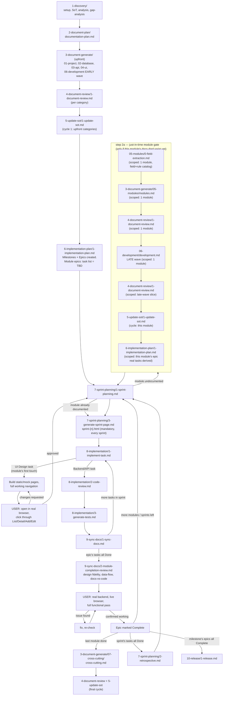
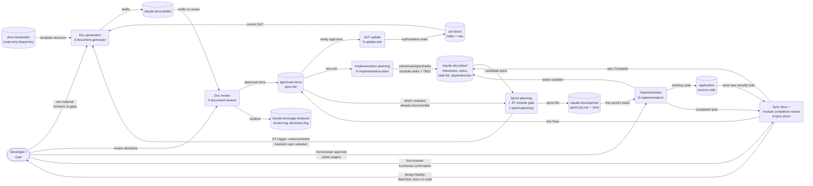

# project-docs-template

A clean, project-agnostic copy of `project-docs/` — no project-specific content, ready to bootstrap a new project.

## How to use

1. Copy this entire folder into the new project's root, renamed to `project-docs/`:
   ```
   cp -r project-docs-template <new-project-root>/project-docs
   ```
2. In the new project, run `project-docs/prompts/1-discovery/1-project-setup.md` first — it confirms this structure and creates the new project's root `CLAUDE.md`, `README.md`, `CHANGELOG.md`.
3. Follow `project-docs/prompts/README.md`'s workflow from there — one prompt at a time, in order, per its own "Determining next" section.

## What's included

- `docs-templates/` — the fixed, seven-category blueprint library. Read-only, never edit.
- `prompts/` — the full phase-numbered prompt library (`1-discovery/` through `12-maintenance/`), refined across several rounds of real-world use — including `9-sync-docs/2-module-completion-review.md`, added after design-drift, cross-module data-flow, and doc-vs-code gaps were found slipping past every per-task check and only caught by later ad hoc review. Since v7, `3-document-generate/` is one batch prompt per category (all of a category's documents in one run), not one prompt per document. Since v8, module-specific documentation (`5-modules/`, `6-development/`'s late wave) generates just-in-time per module instead of all upfront — see "How the workflow flows" below. Since v9, each module's JIT gate starts with an exhaustive field-and-rule extraction pass (`05-modules/0-field-extraction.md`) before any of its 11 documents are drafted, closing the gap where a module's schema/business-rules/data-dictionary/validation docs could otherwise be generated straight from a necessarily-incomplete BRD.
- `approved-docs/`, `claude-docs/`, `sot-docs/` — empty scaffolds, ready for a new project's actual content.
- `tools/validate-template.mjs` — a zero-dependency Node script that checks `prompts/` for broken cross-references, missing `**Prompt version:**` lines, and document-count drift against `docs-templates/`. Run it (`node tools/validate-template.mjs`) after editing anything under `prompts/` or `docs-templates/` — catches the kind of dead "Next Step" link that v7.6 above only found via a full manual read-through, mechanically instead of by hand. See the maintenance comment at the top of the script itself for when it needs updating vs. when it doesn't.

## What's not included

- No project-specific business content anywhere — verified clean.
- No root-level `CLAUDE.md`/`README.md`/`CHANGELOG.md` — those get created fresh by `1-project-setup.md` for whatever new project this becomes.

## How the workflow flows



**Reading it:** the top half (upfront) generates the shared foundation every module needs — project overview, database, API, UI standards, dev environment — once, before implementation starts. From `7-sprint-planning/` onward, the loop repeats per sprint: any module touched for the first time gets its own 11 documents generated right then (the JIT gate), a brand-new module's UI gets built with static data and approved by the developer in a real browser before backend work starts, and a module's backend can't be marked done until the user has actually clicked through the real, working feature themselves. `07-cross-cutting/` — the one category that needs the full picture — waits for every module to finish this cycle before it runs, once, at the end.

## Data flow (DFD)

Same workflow, viewed as data moving between the developer, Claude's generation/review steps, and the files that persist state — stadium shapes are external entities, rounded boxes are processes, cylinders are data stores (folders/files on disk).



**Reading it:** Claude never writes application code or docs from thin air — every process reads from a store (templates, drafts, docs-kit, SoT, plan) and writes back to one, and the developer is the only external entity, sitting at both ends of two loops: approving documents before they're promoted, and approving working software (static pages, then real functionality) before a module counts as done. The one flow that makes this template's v8 change visible here is `P5 → P1` — sprint planning feeding back into document generation, module by module, instead of generation only ever flowing forward.

## Keeping this template current

If you improve `prompts/` or `docs-templates/` on a real project later (the same way earlier findings got folded back into `9-sync-docs/`, `6-implementation-plan/`, and `10-release/`), copy the fixed files back into this template's copies so future projects benefit too — this folder doesn't auto-update.

**Note on `Prompt version` lines vs. this changelog:** the changelog below records the *notable* changes behind each version bump, not every bump — a file's on-disk `**Prompt version:**` line can be ahead of the highest version this changelog mentions for it (a later, undocumented touch-up). The changelog entry is still accurate for what it describes; it just isn't a complete version history. Treat the file's own header line as the source of truth for "what version is this," and this changelog as "why did notable versions change," not a 1:1 log of every bump.

## v9.1 changes (over v9) — fixes found by actually running v9's field-extraction on a real module

Found while running `0-field-extraction.md` for real, for the first time, against a live legacy
codebase (an actual pilot run, not a dry read of the prompt). Three sub-agents ran in parallel
(entities, rules, workflow); two had already finished full-depth work before a scope-narrowing
instruction arrived mid-run, and both independently made the same reasonable call (keep the
finished work, don't discard it) — which is the right call, but it was judgment, not something
the prompt actually said to do.

- **`0-field-extraction.md`** (bumped to 1.1) — new "Depth" section stating full coverage is the
  default and that an in-progress document should finish at its current depth rather than being
  cut short by a late-arriving scope change; new required **Coverage Statement** at the end of
  every output document (what was read, what deliberately wasn't — distinct from Open Questions,
  which covers what was read but couldn't be resolved); two new Guardrails and a Completion
  Checklist item for both.
- **`2-document-plan/1-documentation-plan.md`** (bumped to 1.5) — the existing "these categories
  can run in parallel" rule now states *why* it's safe (each category grounds in `decisions-log.md`
  only, never another category's in-progress draft) and flags that the grouping stops being valid
  if a future template change makes one category need to read another's content directly.

## v9 changes (over v8) — module field & rule extraction, closing the completeness gap

v8's JIT module gate still drafted a module's 11 documents (`3-business-rules.md`, `4-schema.md`,
`5-data-dictionary.md`, `6-validation.md` included) straight from the SoT plus summary-level
analysis (`business-rules-summary.md` is a bullet list, not a field catalog), catching gaps
reactively via `[NEEDS INPUT]`/`[Assumption]` as each document was drafted. That prevents silent
hallucination but never guaranteed exhaustiveness — a BRD rarely enumerates every entity field or
every rule precisely, and a reactive per-document pass can miss a field it never thought to ask
about, not just one it noticed and flagged. Found while piloting this template's method against a
real system being replaced (a full field-by-field, rule-by-rule extraction pass run directly
against that system's actual source code and live database, independent of any BRD), where the
gap between "summary-level analysis" and "exhaustive field catalog" became concrete and visible
for the first time.

- **New `3-document-generate/05-modules/0-field-extraction.md`** — runs as step 0 of a module's
  JIT gate, before any of its 11 documents are drafted. Produces an exhaustive, individually-listed
  field catalog and numbered business-rule catalog for the module (never grouped/summarized),
  each entry tagged `Confirmed` / `Inferred` / `Underspecified` (a new third tier — distinct from
  `Inferred`, meaning the source shows a field/rule exists but doesn't describe it well enough to
  fill in confidently, versus `Inferred` meaning it's deduced but not stated). Supports two origins
  per module: **Extracted-from-existing-system** (real source code + live schema, every fact cited
  to file:line/query — for a module with a live predecessor) or **Derived-from-SoT-plus-questions**
  (for a genuinely new module). Cross-checks fields against rules in both directions (every field a
  rule touches must be cataloged; every cataloged field should be consciously used or noted
  standalone) and requires concrete enum/lookup value lists rather than "this is an enum."
- **`5-modules/modules.md`** (bumped to 1.6) — new step 0 and a new Prerequisites/Inputs entry:
  won't draft `3-business-rules.md`/`4-schema.md`/`5-data-dictionary.md`/`6-validation.md` for a
  module until that module's field-extraction documents exist with no unresolved Blocking open
  question. Citation convention extended to allow citing a field-extraction rule ID directly.
- Field-extraction output lands in a new location — `project-docs/claude-docs/analysis/
  module-field-extraction/<module-slug>/` — alongside the existing project-wide analysis
  artifacts, not inside the 11-file module deliverable itself (it's a working fact base the
  deliverable is generated from, not one of the 11 documents).
- Open questions raised during extraction carry an explicit **Blocking?** flag (blocks an entire
  capability vs. a narrow, isolated gap) — the same Blocking/Non-blocking split
  `1-discovery/6-gap-analysis.md` already used for project-level gaps, now applied at field/rule
  granularity too.

## v8 changes (over v7.7) — just-in-time module documentation

Every prior version generated all documentation upfront, including all 11 documents for every module in `5-modules/`, before implementation planning even began. On a project with many modules this front-loaded a lot of writing for modules that wouldn't be built for months. v8 defers module-specific work to the moment it's actually needed, and closes the loop with a required human check at both ends of a module's build.

- **`5-modules/modules.md` and `06-development/development.md`'s late wave are no longer part of the upfront documentation batch.** They're now triggered by a new step 2a in `7-sprint-planning/1-sprint-planning.md`, the first time a module's `<Module> — UI Design` or `<Module> — Backend/API` epic is a candidate for an upcoming sprint. The late wave is now scoped and updated per module (folding each module's structure into the same four documents) instead of waiting for every module to finish. `07-cross-cutting/cross-cutting.md` still runs last, always — but under this model that means after the *last* module's JIT cycle, not right after the other upfront categories.
- **`6-implementation-plan/1-implementation-plan.md`** (bumped to 1.4) — its initial run derives module epics from `module-list.md` alone (not `docs-kit/5-modules/`, which doesn't exist yet) and leaves each module epic's task list empty/TBD. A new "Re-run scoped to a single module" mode fills in that task list once the JIT gate above generates the module's real documentation. Epic `Complete` now also requires the new user browser acceptance check (see below), not just automated checks passing.
- **New `7-sprint-planning/3-generate-sprint-page.md`** — generates a self-contained `sprint-{{n}}.html` status page after every sprint is planned. Unlike `11-dashboard/1-generate-dashboard.md` (on-demand), this one is mandatory, run every sprint right after `1-sprint-planning.md`.
- **Static UI pages must be fully navigable, not isolated mockups.** `8-implementation/1-implement-task.md`'s Module Design-First Strategy now requires real, working inter-page navigation (List → Detail → Add/Edit → back) against a shared mock dataset — only the backend/API call is stubbed, not the routing. The developer's review of these pages now means opening them on a real local dev server and clicking through, not approving off a text description.
- **New required user browser acceptance check before a module (backend) can be marked `Complete`.** `9-sync-docs/2-module-completion-review.md` (bumped to 1.1) adds a closing step: once its own automated checks (design fidelity, data-flow trace, docs-vs-code) pass, the user manually exercises the module's real functionality in a browser against the real backend, and anything they report wrong gets fixed and re-checked until they explicitly confirm it works. This confirmation is now a separate, required condition for Epic `Complete`, alongside — not replacing — Claude's own checks.
- **`5-update-sot/1-update-sot.md`** (bumped to 1.1) — now runs multiple times per project (after the upfront categories, after each module's JIT cycle, and once more after the final `07-cross-cutting/` sweep) instead of once; its Next Step branches on which cycle just finished.
- **`prompts/README.md`** — new "Just-in-time module documentation" section, folder tree, phase table, and "Determining next" all rewritten for the JIT flow; new flow diagram added (see below).
- **`prompts/GLOSSARY.md`** — two new terms: *Just-in-time (JIT) module documentation*, *User browser acceptance*. The existing *Wave* definition updated to describe the late wave's new per-module trigger.
- Fixed a filename-numbering collision the new sprint-page prompt would otherwise have created against the existing `7-sprint-planning/2-retrospective.md` — the new file is `3-generate-sprint-page.md`, per this template's own "append at the end of the category" numbering-insertion policy (see v4 above), not a renumber of the existing file.
- **All seven `3-document-generate/*` prompts** (bumped) — no more silent `[Assumption: ...]` guesses. When something's unclear, the prompt now collects it as an open question, asks the developer everything for that document in one batched round once drafting is otherwise done, and only writes final content after the developer answers. `[Assumption: ...]` now only appears when the developer explicitly said "use your judgment" — a deferred, approved call, not a silent one. `[NEEDS INPUT: ...]` is reserved for something genuinely blocking even after asking. `prompts/GLOSSARY.md` and `prompts/README.md`'s pre-flight-check section updated to match. Scoped to document generation only — planning/implementation prompts (`6-implementation-plan/`, `7-sprint-planning/`, `9-sync-docs/`) keep their existing pattern.
- **New `tools/validate-template.mjs`** — zero-dependency Node script that checks every `prompts/` cross-reference resolves to a real file, every prompt file carries a `**Prompt version:**` line, and stated document counts match `docs-templates/`'s actual file counts. Run after any edit to `prompts/` or `docs-templates/`, before publishing a template change — catches the class of dead-link bug v7.6 above only found via a full manual read-through, mechanically instead of by hand. The script documents in its own header comment when it needs updating (a new cross-reference/marker convention) versus when it doesn't (ordinary content edits).

## v3 changes (over v2)

Added after a role-based review (Business Analyst through Project Lifecycle Advisor) surfaced further gaps in v2's process rigor:

- `1-project/templates/5-non-functional-requirements.md` + matching prompt — measurable performance/availability/security targets, separate from the feature list.
- `6-development/templates/11-threat-model.md` + matching prompt — attack surface, threats, mitigations, cross-checked against the auth/authz docs.
- `1-discovery/6-gap-analysis.md` — cross-cutting decisions now recorded as full ADRs (context/options considered/decision/consequences) in `decisions-log.md`, not flat statements.
- `4-ui/templates/3-design-system.md` — concrete Empty & Error State Patterns table, replacing vague "show an illustration" guidance.
- `claude-docs/plan/raid-log.md` and `tech-debt-register.md` — initialized by `6-implementation-plan/`, maintained every sprint by `7-sprint-planning/` and `8-implementation/2-code-review.md`.
- `claude-docs/plan/lifecycle-dashboard.md` — one-page status rollup, refreshed by every phase that changes a status it summarizes.
- `10-release/1-release.md` — added a UAT sign-off step, distinct from the automated test suite.
- `9-sync-docs/2-module-completion-review.md` — added an automated accessibility check as a fast, mechanical first step, not just an end-of-milestone concern.
- Every prompt file now carries a `**Prompt version:**` line, so future template revisions can be tracked file-by-file, not just folder-by-folder.

## v4 changes (over v3) — structural restructure

A structural review (numbering fragility, where cross-cutting docs belong, status-model duplication, parallel-track support, small-project scaling) produced these changes:

- **New `7-cross-cutting/` category**, run last. `1-non-functional-requirements.md` (moved out of `1-project/`) and `2-threat-model.md` (moved out of `6-development/`) now live here instead of wherever had a free filename slot — neither is really "what we're building" or "how we build day-to-day," they're a third thing that cross-checks everything else. `docs-templates/1-project/` and `docs-templates/6-development/` are back to their original 4/10-file counts.
- **Numbering-insertion policy documented** in `prompts/README.md`: new documents append at the end of their category, or use letter-suffixed filenames (`4a-name.md`) for genuine mid-sequence inserts — never a full renumber, which breaks every cross-file "Next Step" reference. (This is *only* a policy for future changes — existing files were not renumbered.)
- **Centralized status-rollup rule.** `8-implementation/1-implement-task.md` and `2-code-review.md` no longer restate the `Complete`/`In Progress`/`Blocked` rollup algorithm — both now point to the single canonical definition in `6-implementation-plan/1-implementation-plan.md`'s "Status Tracking" section.
- **Parallel-track structure made explicit**, not just a prose aside: `2-document-plan/1-documentation-plan.md` now requires marking every document as parallel-safe or sequential; `prompts/README.md`'s tree/table state directly that `02-database/`, `03-api/`, `04-ui/` (and `06-development/`'s early wave) have no dependency on each other.
- **New "Lite path for small projects" section** in `prompts/README.md` — an explicit, sanctioned reduction of the full workflow for small builds, naming exactly what's safe to skip and what never is (gap-analysis decisions inventory, module-completion-review, the four-checks-plus-E2E rule).

## v5 changes (over v4) — closing the remaining reliability gaps

No process gets to literal 99.99%, but this pass closes every remaining known gap from the structural/role-based reviews:

- **New `1-discovery/7-change-request.md`** — on-demand handling for a requirement changing after docs/tasks already exist. Traces the full blast radius (approved docs + Done/in-flight tasks + `decisions-log.md`) instead of letting changes get silently patched in.
- **Incident-to-task traceback.** `10-release/2-incident-response.md` now requires tracing a production defect back to its originating task and asking whether that epic's `module-completion-review` ran, ran-but-missed-it, or never ran — turning a recurring bug class into a signal about the review process itself, not just a one-off fix.
- **Definition of Ready, formalized.** `7-sprint-planning/1-sprint-planning.md` and `8-implementation/1-implement-task.md` both gate on it now — a task with an open `[NEEDS INPUT]` or unmet dependency can't be claimed, not just "should be flagged."
- **Confidence summary on every reviewed document.** `4-document-review/1-document-review.md` now records a Source/Assumption/NEEDS-INPUT count per document, so review effort in a 100+ document project isn't spent uniformly on docs that don't need it.
- **Resumability guidance** for interrupted multi-step runs (`README.md` + `05-modules/modules.md` directly) — resume from the last completed item, never restart a batch from zero.
- **SoT freshness check** added to every sprint retro — the recurring moment that catches slow drift between `sot-docs/raw/` and reality on a long project, routed through the new change-request prompt when found.

## v6 changes (over v5) — reliability + developer-experience pass

- Filled the previously-empty `3-api/templates/9-openapi.yaml` and `10-postman-collection.json` with real generic skeletons; updated their generation prompts (`3-document-generate/03-api/9-openapi.md`, `10-postman-collection.md`) to describe replacing the example resources rather than the old dead "if empty, generate from scratch" branch.
- Fixed `7-cross-cutting/` being omitted from `docs-templates/README.md`'s folder diagram/purpose table, and from stale "six category" counts across `README.md` (this file), `prompts/1-discovery/1-project-setup.md`, `prompts/2-document-plan/1-documentation-plan.md`, and `prompts/4-document-review/2-documentation-review.md`. Also added the missing `approved-docs/docs-kit/7-cross-cutting/` and `claude-docs/drafts/7-cross-cutting/` scaffold folders — the pipeline had nowhere to draft or promote cross-cutting docs into.
- `2-database/templates/2-erd.md` — converted ASCII-art relationship diagrams to Mermaid `erDiagram`, and collapsed redundant per-relationship text blocks into one foreign-key table.
- Added the `[Assumption: ...]`-labeling guardrail (already used in `7-cross-cutting/1-non-functional-requirements.md`) to `6-development/templates/7-deployment-strategy.md` and `3-api/templates/1-api-design.md`'s AI Generation Notes, so numeric targets/limits aren't invented unlabeled in those documents either.
- **New `11-dashboard/1-generate-dashboard.md`** — on-demand prompt that regenerates a self-contained static `claude-docs/plan/dashboard.html` (Milestone/Epic/Task/Sprint progress, open risks, tech debt) for viewing in a browser, no server required.
- **New `prompts/GLOSSARY.md`** — plain-language definitions of the workflow's own vocabulary, pointed to from root `CLAUDE.md`.
- **New developer-communication conventions**, documented in `prompts/README.md` and copied into every generated `CLAUDE.md`: plain-language-first questions (explain what each option does and why one's recommended, not just label it), icon+label status prefixes (⚠️/🚫/❌/✅/ℹ️) since chat can't render color, a pre-flight scan for unresolved `[NEEDS INPUT]`/`[Assumption]` markers before starting the next prompt, previews before large multi-file actions, a session-start status recap, confirmation before overwriting existing output, and actionable (not just descriptive) guardrail/error messages.
- `docs-kit/6-development/4-git-workflow.md` and `8-implementation/1-implement-task.md` — added a task-ID-in-branch-name convention as a lightweight multi-developer collision guard, so two developers are less likely to silently claim the same task.
- Removed a real project name/reference that had leaked into this file (violated this template's own "no project-specific content" rule).
- **Multi-developer support made explicit, not assumed.** Added an **Assigned To** field to `task-list.md`/sprint-file schema (`6-implementation-plan/1-implementation-plan.md`, `7-sprint-planning/1-sprint-planning.md`); sprint planning now groups tasks into parallel-safe batches by file/folder footprint and assigns each batch to a named developer instead of leaving one shared queue; `8-implementation/1-implement-task.md` now requires pulling the latest `claude-docs/` state before claiming and respects batch ownership, not just per-task status. New "Multiple developers working in parallel" section in `prompts/README.md` documents what is and isn't guaranteed (no hard atomic lock on claiming).
- **New Module Design-First Strategy**, optional per module (`8-implementation/1-implement-task.md`): build a module's pages first with static/mock data matching the already-approved database/API docs, loop developer review until approved, then let the developer choose to build that module's real backend or design the next module first — tracked with the same effort regardless of module order. Adds a **Design Status** field to `epics.md` (`6-implementation-plan/1-implementation-plan.md`), a documented exception allowing this specific UI/backend split (normally discouraged elsewhere in this kit), a Definition-of-Ready gate in `7-sprint-planning/1-sprint-planning.md` requiring Design Status `Approved` before a backend task can be scheduled, a cross-module dependency check before backend work starts on any module, and a Design Status badge in `11-dashboard/1-generate-dashboard.md` so a fully-designed-but-backend-pending module doesn't read as a stalled epic. *(Later made the default under the Milestone 2/3+ structure — see below.)*

## v6.1 changes — default Milestone 2/3+ structure

- **Default milestone structure changed**, unless the user directs otherwise (`6-implementation-plan/1-implementation-plan.md`): Milestone 1 is tech-stack/environment install only (no feature/UI work, exempt from the demoable-slice rule); Milestone 2 is UI for every module/page project-wide using static/mock data (supersedes the old walking-skeleton default, which was auth + dashboard shell only); Milestone 3 onward wires real backend/API onto one module (or a small dependency-ordered group) at a time, vertical-slice style. A fully vertical structure (one milestone per module, UI and backend together) is still available on request.
- **Module Design-First Strategy is now the default**, not opt-in, for every module under the Milestone 2/3+ structure (`8-implementation/1-implement-task.md`) — the per-module "want design-first or not" question is skipped, since the UI Design / Backend epics are already planned into separate milestones. The ask-once opt-in flow is kept for projects that choose the fully vertical structure instead.
- Updated for consistency with the above: `7-sprint-planning/1-sprint-planning.md`'s Sprint 1 note, `prompts/GLOSSARY.md`'s Design Status definition, and the Design Status field description in `6-implementation-plan/1-implementation-plan.md`'s Output section.
- **`prompts/GLOSSARY.md`** — added the terms introduced by this pass (Assigned To, parallel-safe batch, Design Status) so the glossary doesn't fall behind its own template.
- **`11-dashboard/1-generate-dashboard.md`** — task table now shows **Assigned To**, and groups the sprint's task list by parallel-safe batch when one exists, instead of one flat list.
- **`8-implementation/3-generate-tests.md`** — added an explicit exception for `<Module> — UI Design` tasks: no automated unit/integration/API tests (there's no real logic yet), at most a lightweight render check — the developer's review-and-approve loop is that task's actual acceptance gate, not the test suite.
- **`1-discovery/7-change-request.md`** — now checks whether a changed requirement affects a module currently mid-review-loop (Design Status `Pending Review`) and flags it before the next review round, instead of only checking approved docs and Done/in-flight tasks. Also removed a second leaked project-specific reference ("Admin-scope-propagation gaps") from this file, same class of issue as the Legacy Lighting leak fixed above.
- **`8-implementation/1-implement-task.md`** — the design-review loop now runs a quick automated accessibility check (per `docs-kit/4-ui/7-accessibility.md`) before showing pages to the developer, catching a11y issues at the cheapest possible point instead of waiting for end-of-epic `module-completion-review`.

## v7 changes (over v6.1) — batch generation for token/speed, quality unchanged

Every prior version added rigor (more checks, more traceability, more explicit process). v7 is the first pass aimed the other direction — reducing token spend and elapsed time per project — while keeping every existing quality gate (traceability, review, SoT-sync) exactly as strict as before. The trigger: v6's `prompts/README.md` "Required workflow for Claude Code" section mandated *"Never batch multiple prompt files into a single run"* — one confirm-then-execute round trip per document. For the six non-module categories (`01-project` through `07-cross-cutting`, up to 10 documents each), that meant up to 10 separate stop-and-confirm exchanges per category, each reloading the same shared context (SoT, decisions-log, templates) from scratch. `05-modules/modules.md` already proved a batched alternative works — one prompt, 11 documents, one run — so v7 extends that pattern everywhere else, deliberately loosening the "never batch" rule this one time, not by accident.

- **Batch generation, one prompt file per category.** `3-document-generate/`'s six non-module categories are each now a single batch file instead of one-file-per-document: `01-project/project.md` (was 4 files), `02-database/database.md` (was 4), `03-api/api.md` (was 10), `04-ui/ui.md` (was 8), `06-development/development.md` (was 10, now run as two internal waves — see below), `07-cross-cutting/cross-cutting.md` (was 2). `05-modules/modules.md` is unchanged, already batched since v5. The old per-document files were deleted once their content was fully merged in — every document's original instructions/guardrails/AI-generation-notes are preserved inside the new batch file, nothing summarized away. To regenerate just one document, each batch file documents how to scope itself to a single file, same pattern `modules.md` already used.
- **`06-development/development.md`'s two waves.** This category has a real dependency gate, not just a size split: its early-wave documents (environment, folder structure, coding standards, git workflow, containerization, CI/CD) have no dependency on modules and can run alongside `02`–`04`; its late-wave documents (implementation workflow, testing strategy, deployment strategy, debugging guide) reference the finished module set and must wait until every module in `05-modules/` is done. The batch file runs as two separate confirmed passes for this reason — still one confirmation per wave, not per document.
- **One confirmation per batch, not per document.** `prompts/README.md`'s "Required workflow for Claude Code" section now confirms once before a whole batch runs, then lets it complete uninterrupted — no per-document stop inside a batch, except a genuine blocking guardrail (missing prerequisite, `06-development`'s wave boundary).
- **Batch review, per category/module.** `4-document-review/1-document-review.md` (bumped to v2.0) now reviews a whole category's or module's drafts together in one sitting instead of one file at a time — catching same-batch inconsistencies a document-at-a-time review would miss (since later documents in the same batch didn't exist yet when an earlier one was reviewed). Verdict and promotion are still recorded per individual document in `review-log.md`; only the review sitting is batched, not the judgment.
- **Gap-analysis now sweeps every template's sections upfront.** `1-discovery/6-gap-analysis.md` (bumped to v2.0) adds a per-document, per-template-section pass across all seven categories before any generation starts — surfacing likely gaps as questions at the cheapest possible point (before writing), instead of only discovering them mid-batch. Genuinely unpredictable gaps still surface later via the existing `[NEEDS INPUT]`/`[Assumption]` labeling; the goal is fewer total questions across the whole project, not moving every question to "before" by force.
- **Fix-pointers updated** in `4-document-review/1-document-review.md` and `2-documentation-review.md` (bumped to v1.2) — a rejected document or a fix from the final sweep now points back at "re-run the category/module's batch file, scoped to just this document," since the old single-document prompt files no longer exist.
- **Lean-notes reminder** added to `9-sync-docs/1-sync-docs.md` (bumped to v1.1) — `CLAUDE.md` and `sot-docs/index.md` get read at the start of every session, so unpruned growth is a cost paid every session, forever; this step is a periodic nudge to trim stale content while syncing, not a new scheduled task.
- **`prompts/README.md`** — folder tree, category table, "Required workflow," "Preview before large or multi-file actions," "Determining next," and "Resuming an interrupted run" sections all updated to describe the batch model. **`prompts/GLOSSARY.md`** gained three new terms: *Batch generation*, *Wave*, *Pre-generation gap sweep*.
- **Explicitly not changed:** the draft → review → promote flow, SoT traceability requirements, decisions-log compliance checks, and every other existing quality gate — this pass only changes *when* confirmation/review happens, not *what* gets checked.

## v7.1 changes — fixes from a full pilot run

A full pilot project (`pilot-project-v7`, a minimal task tracker) was run end-to-end through every phase from `1-project-setup.md` to `5-update-sot/1-update-sot.md` — all 7 categories, 49 documents, batch generation, batch review, resumability, the `06-development` two-wave gate, and the final cross-cutting sweep. Result: the batching mechanics worked as designed, and the pilot also caught real gaps (a missing CSRF mitigation only surfaced by the final `7-cross-cutting/2-threat-model.md` sweep; a JavaScript-vs-TypeScript decision missed by an incomplete gap-sweep pass). Four fixes came directly out of that run:

- **`1-discovery/6-gap-analysis.md`** (bumped to 2.1) — the per-category gap sweep's Completion Checklist now lists all seven categories individually instead of one combined line, so a partial pass (e.g. sampling 3 of 7 categories) can't be checked off as done. The pilot's own TypeScript/JavaScript gap slipped through an incomplete sweep exactly this way.
- **`4-document-review/2-documentation-review.md`** (bumped to 1.3) — the final `[NEEDS INPUT]` sweep now greps for the exact marker syntax (`[NEEDS INPUT:`, with the colon) instead of the bare phrase, which could false-positive on a document's own prose describing a *previously* open marker now resolved (this happened during the pilot). Also added a guardrail making explicit that a fix found by the final sweep may require reopening an already-approved document from an earlier, finished category — expected behavior, not an error, since that's the entire reason this phase runs last.
- **`3-document-generate/07-cross-cutting/cross-cutting.md`** (bumped to 1.1) — added a matching guardrail: if `2-threat-model.md` finds a real unmitigated gap in an already-approved document (the pilot's CSRF finding against `3-api/2-authentication.md`), resolve it via `decisions-log.md` and patch the earlier document, don't just note the gap and move on.
- **`prompts/README.md`** — "Lite path for small projects" now acknowledges that the pre-generation gap sweep runs before `documentation-plan.md` exists, so it can't yet know what a small project will mark Not Applicable; permits a lighter skim for categories you're already confident will end up mostly skipped, but not skipping the walk entirely.

## v7.2 changes — per-category `docs-kit/` README

- **`4-document-review/1-document-review.md`** (bumped to 2.1) — the promote step (step 8) now also creates/updates a `README.md` in each `docs-kit/<category>/` folder (and each module's own folder under `5-modules/`) whenever a document lands there. Content: the category's purpose (adapted from `docs-templates/<category>/README.md`, with its `templates/<file>` paths rewritten to the flat `docs-kit/<category>/<file>` paths actually used) plus a table of what's currently promoted. `docs-templates/` itself is unchanged — this only affects the generated output side, which previously had no per-folder orientation beyond the single top-level `approved-docs/README.md`.
- **`approved-docs/README.md`** — documents the new per-category README convention.

## v7.3 changes — Session Boundaries section actually shipped

Session-splitting (per category/batch for doc-gen, per task/sprint for implementation, milestone as outer wrapper only) was designed and agreed on during this template's own development, but never actually written into `prompts/README.md` — it only existed as a planning note. The gap surfaced concretely: the session that built all of v7 and ran its full pilot end-to-end (`pilot-project-v7`, 49 documents, all 7 categories) never split itself, and finished at 52% of a 967k-token context window, with "Messages" (accumulated conversation content) alone accounting for 47.2% of that — the exact cost pattern splitting is meant to prevent.

- **New `## Session Boundaries` section in `prompts/README.md`** — documents the default split points (category/batch for doc-gen, task/sprint for implementation), adds an adaptive trigger (split before a natural boundary arrives if context is visibly climbing past ~150k tokens rather than waiting for the scheduled boundary), and states plainly that this kit's prompts are meant to run in the main session, not be delegated to subagents to manage size — delegating adds a second cost on top of context growth rather than solving it.

## v7.4 changes — dashboard now covers documentation progress, not just implementation

Batching (v7's core change) means a category can be mid-review — some documents drafted, some approved, some rejected and awaiting a fix — and Session Boundaries (v7.3) now actively encourages splitting documentation generation across sessions per category. Neither is visible anywhere without opening folders one at a time; `11-dashboard/1-generate-dashboard.md` only ever covered the implementation side (Milestones/Epics/Tasks/Sprints).

- **`11-dashboard/1-generate-dashboard.md`** (bumped to 1.3) — adds a **Documentation** section to the generated dashboard: per category (and per module under `5-modules/`), a progress bar and count of documents `Not Started` / `Drafted` / `Approved`, derived from `documentation-plan.md`, `claude-docs/drafts/`, `review-log.md`'s latest verdict per document, and `approved-docs/docs-kit/`. Documents a project's `documentation-plan.md` explicitly marked skipped are `Not Applicable` and excluded from the progress math, not counted as incomplete. Status color mapping extended (`Approved`=green, `Drafted`=blue, `Rejected`=red, `Not Applicable`=strikethrough grey) to match the existing implementation-side palette rather than inventing a separate one. The header's one-line rollup now covers both phases.
- **`prompts/README.md`** — folder tree and table entry for `11-dashboard/` updated to describe the widened scope.

## v7.5 changes — dashboard visual/structural upgrade

Modeled on a real, richer reference dashboard (stat tiles, a sprint plan table, a nested epic/task breakdown with progress bars, a detailed blockers section, and a "scoring method" transparency footer). Explicitly scoped down from that reference in one deliberate way: the reference parsed actual application source code (live endpoints from route files, test counts, file:line evidence) — this kit's dashboard stays markdown-only, matching every other prompt in this kit (`project-docs/claude-docs/` only, never the app's own source), and works from project day one before any code exists. Confirmed with the user as the intended scope, not a limitation slipped in silently.

- **`11-dashboard/1-generate-dashboard.md`** (bumped to 2.0 — structural rewrite, not incremental): stat-tile row (Overall Delivery, Documentation, Sprints, Tasks, Open Blockers — each with a subtext explaining its number), a sprint-by-sprint plan table with real per-row Notes (not generic status restatements), a collapsible Milestone → Epic → Task breakdown (this kit's actual hierarchy — no invented Feature/Story layer), a Legend section stating exactly what each badge represents in this kit's own terms, a richer Blockers section (full sentences with concrete detail, not one-line RAID restatements), and a new "Scoring method" section stating the weighting method used (point- vs. count-based) and the markdown-only trust boundary explicitly, so a reader knows exactly how much to trust each number.
- New explicit **Scope** section in the prompt itself, and a matching guardrail, stating the dashboard never reads application source code — a deliberate boundary, not an oversight, kept consistent with the rest of this kit's design.
- **Auto-refresh.** `dashboard.html` now includes `<meta http-equiv="refresh" content="60">` (bumped to 2.1) — a browser tab left open on it picks up a newer version automatically if the dashboard prompt gets re-run, instead of needing a manual refresh. Local file reload only, no network request.

## v7.6 changes — the prompt chain, followed cold, was broken

A full read-through of the whole tree (not a pilot run — a pilot session already has `prompts/README.md`'s workflow in context and follows the correct loop from memory) found that no `3-document-generate/` batch file's "Next Step" ever named `4-document-review/1-document-review.md`. Following the chain as written: `01-project/project.md` sends you straight to `02-database/database.md`, which then halts on its own Prerequisites, since only the review prompt can make `1-project/` actually `Approved`. `03-api/api.md` named no next prompt at all. `07-cross-cutting/cross-cutting.md` jumped straight to the final sweep, whose own prerequisite (everything already `Approved`) was never satisfied by anything upstream. Inherited from v6, but far worse here — v6's 38 small files made a bad pointer cheap to notice; v7's 6 batch files mean one bad pointer skips a whole category's review.

- **All six `3-document-generate/*/` batch files** (bumped) — every "Next Step" now names `4-document-review/1-document-review.md`, scoped to that category/module, before naming the next generation prompt.
- **`3-document-generate/05-modules/modules.md`** (bumped to 1.3) — was internally contradicting `prompts/README.md`'s stated "one module per run" cadence by processing every module in one pass with no review interleaved; realigned to one module per run, review after each, consistent with `4-document-review/1-document-review.md`'s `scope` parameter (one module folder). Prerequisites also corrected from "fully generated" to "fully generated and approved," matching every other batch file.
- **`3-document-generate/07-cross-cutting/cross-cutting.md`** (bumped to 1.2) — fixed an input path to a file that doesn't exist (`docs-kit/2-database/5-data-dictionary.md` — the data dictionary is a per-module `5-modules/<slug>/` document, `2-database/` has no such file), which its own guardrail was turning into a false halt.
- **`database.md`, `api.md`, `ui.md`, `development.md`** — fixed self-contradictory phrasing ("read every already-approved document within this batch") that pointed at `docs-kit/` for a sibling document still sitting as a draft, triggering the same false-halt guardrail.
- **`2-document-plan/1-documentation-plan.md`** (bumped to 1.3) — corrected `6-development`'s early-wave document count (was stated as 4, actually 6, per `development.md` and `prompts/README.md`) so a real project's generated plan doesn't propagate the wrong count; also removed "sub-agents" from its parallel-generation guidance, which contradicted `prompts/README.md`'s explicit no-subagent stance.
- **`4-document-review/1-document-review.md`** (bumped to 2.2) — the promote step now creates `review-log.md` with a header row if it doesn't exist yet, since nothing previously created the file every other phase assumes exists.
- **`11-dashboard/1-generate-dashboard.md`** (bumped to 2.2) — auto-refresh interval slowed from 60s to 300s (the page only changes when this prompt is re-run, far less often than every minute), and the reload now persists expanded milestone/epic rows and the text filter to `sessionStorage` and restores them on load, so a reload during reading is invisible instead of collapsing the whole nested breakdown.
- **`6-implementation-plan/1-implementation-plan.md`** — same stale "session/sub-agent" phrasing corrected.

## v7.7 changes — a post-launch phase, where there previously wasn't one

The kit was shaped for building a project once. After the first milestone shipped, three lanes already existed (`10-release/2-incident-response.md`, `1-discovery/7-change-request.md`, `9-sync-docs/1-sync-docs.md`) but nothing routed to them, and two real gaps had no lane at all: a brand-new feature request had nowhere correctly-sized to go (`1-release.md`'s Next Step sent it back through full greenfield discovery — right for a new project, absurd for one feature), and "set up a lightweight intake process" (`1-release.md` step 10) was never actually defined anywhere.

- **New `prompts/12-maintenance/` folder, three prompts:**
  - **`1-triage.md`** — the single post-launch entry point. Classifies any incoming item into one of six lanes (production incident, requirement change, new feature, non-urgent defect, doc/code drift, routine upkeep) and hands off; never resolves the item itself. Logs every item to the new `claude-docs/plan/intake-log.md` — the concrete implementation of the intake process `1-release.md` previously only gestured at.
  - **`2-feature-request.md`** — the correctly-scaled replacement for looping a new feature through full discovery. Runs discovery/gap-analysis scoped to just the feature, appends a dated delta section to the existing `documentation-plan.md` instead of replacing it, generates only the documents the feature actually touches, and plans it as a **new milestone** — keeping the existing release flow (release notes, version bump, UAT sign-off) working unchanged.
  - **`3-upkeep.md`** — dependency bumps, security patches, tech-debt pull-in. Runs through the normal implementation loop under a new standing **Maintenance** epic (created once, never assigned a milestone, never closes); regenerates documentation only where a change actually invalidates something already approved, not by default.
- **`prompts/README.md`** — new `## After launch` section explaining the six-lane model and the milestone-per-feature-batch convention; `12-maintenance/` added to the folder tree and prompt table; "Determining next" gains a first check for post-launch mode (any `Released` milestone → start at `1-triage.md`, not the greenfield chain).
- **`10-release/1-release.md`** (bumped to 1.1) — steps 10–11 and the Next Step now point at `12-maintenance/1-triage.md` and `intake-log.md` as the actual intake mechanism.
- **`1-discovery/7-change-request.md`** and **`10-release/2-incident-response.md`** (bumped) — each notes that triage is the normal post-launch path to reach it; an obvious active incident still goes straight to incident-response, not through triage first.
- **`6-implementation-plan/1-implementation-plan.md`** (bumped to 1.3) — new "Re-run after launch" note: this prompt isn't only for the initial plan, it re-runs scoped to one new milestone per feature batch, and creates the standing Maintenance epic the first time it runs post-launch.
- **`11-dashboard/1-generate-dashboard.md`** (bumped to 2.2, alongside its v7.6 fix) — new Maintenance section reading `intake-log.md`, so a fully-released project's dashboard shows current post-launch activity instead of a static 100%.
- **`prompts/GLOSSARY.md`** — four new terms: *Triage lane*, *Intake log*, *Delta documentation plan*, *Maintenance epic*.
- **`claude-docs/README.md`** — `intake-log.md` added alongside the other standing plan files.
