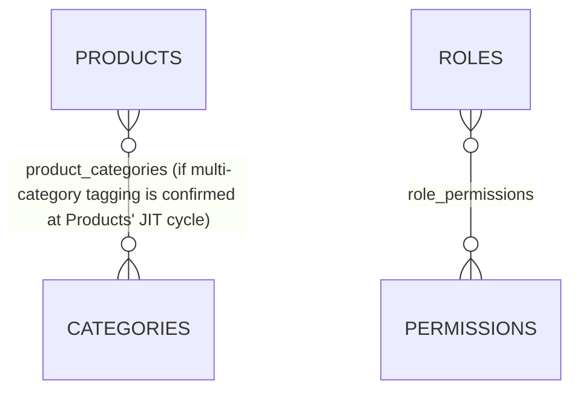

# Entity Relationship Diagram (ERD)

---

# Document Information

| Property | Value |
|----------|-------|
| Project Name | LBM ERP Rewrite |
| Document | Entity Relationship Diagram (ERD) |
| Version | 1.0 |
| Status | Approved |
| Owner | *(unassigned — see `decisions-log.md` ADR-021)* |
| Last Updated | 2026-08-17 |
| Approved By | Claude Code review (`4-document-review/1-document-review.md`, 2026-08-17) |

---

# 1. Purpose

Provides a high-level view of the 15-MVP-module database structure: entities, relationships, ownership,
cardinality. Detailed table definitions, columns, indexes, and constraints generate per module in
`5-modules/<module>/4-schema.md` at that module's own JIT cycle — not duplicated here.

Applies within one tenant's database. The `skeleton` schema-template database additionally carries a
`tenant_registry` table with no per-tenant equivalent — noted in §8, not part of the diagram below.

---

# 2. Database Overview

```
SalesOrder          sales_orders, sales_order_line_items
Accounts             accounts, account_contacts, payment_methods
Users                 users, roles, permissions, role_permissions, time_clock_punches
Location               locations, product_locations
Products                products, product_variants, categories
Vendors                   vendors, vendor_line_codes
SearchLineItem              search_line_items
Settings                      settings_* (split by category, ADR-048)
SalesHistory                    sales_history, sales_history_events
PurchaseOrder                     purchase_orders
PurchaseLineItem                    purchase_line_items
PurchaseHistory                       purchase_history, purchase_history_events
Pricing (unified)                       pricing_plans, price_sheets, promotions, pricing_rules
UOM                                       uom_categories, uom_units, uom_conversions
AccountStatement                            account_statements
(cross-cutting)                                audit_log, audit_deletion_log
```

---

# 3. High-Level Relationship Diagram

```mermaid
erDiagram
    ROLES ||--o{ USERS : "has many"
    USERS ||--o{ ROLE_PERMISSIONS : "via role"
    ROLES ||--o{ ROLE_PERMISSIONS : "grants"
    PERMISSIONS ||--o{ ROLE_PERMISSIONS : "granted by"

    CATEGORIES ||--o{ PRODUCTS : "groups"
    PRODUCTS ||--o{ PRODUCT_VARIANTS : "has variants"
    PRODUCTS ||--o{ PRODUCT_LOCATIONS : "stocked as"
    LOCATIONS ||--o{ PRODUCT_LOCATIONS : "stored at"

    ACCOUNTS ||--o{ SALES_ORDERS : "places"
    SALES_ORDERS ||--o{ SALES_ORDER_LINE_ITEMS : "contains"
    PRODUCTS ||--o{ SALES_ORDER_LINE_ITEMS : "sold as"
    SALES_ORDERS ||--o{ SEARCH_LINE_ITEMS : "materializes on finalize"
    SALES_ORDERS ||--o{ SALES_HISTORY_EVENTS : "writes"

    VENDORS ||--o{ PURCHASE_ORDERS : "supplies"
    PURCHASE_ORDERS ||--o{ PURCHASE_LINE_ITEMS : "materializes on finalize"
    PURCHASE_ORDERS ||--o{ PURCHASE_HISTORY_EVENTS : "writes"
    VENDORS ||--o{ VENDOR_LINE_CODES : "defines"

    PRICING_PLANS ||--o{ PRICING_RULES : "feeds"
    PRICE_SHEETS ||--o{ PRICING_RULES : "feeds"
    PROMOTIONS ||--o{ PRICING_RULES : "feeds"

    UOM_CATEGORIES ||--o{ UOM_UNITS : "groups"
    UOM_UNITS ||--o{ UOM_CONVERSIONS : "converts"

    ACCOUNTS ||--o{ ACCOUNT_STATEMENTS : "generates"
    ACCOUNTS ||--o{ PAYMENT_METHODS : "stores"
    ACCOUNTS ||--o{ ACCOUNT_CONTACTS : "has"
```



Replaces the template's generic e-commerce example with this project's real 15-module entity set.
[Source: `claude-docs/analysis/module-list.md`, `1-database-design.md`]

---

# 4. Entity List

| Module | Primary Entity |
|----------|----------------|
| Users | `users` |
| Users | `roles` |
| Users | `permissions` |
| Location | `locations` |
| Products | `products` |
| Products | `categories` |
| Vendors | `vendors` |
| SalesOrder | `sales_orders` |
| PurchaseOrder | `purchase_orders` |
| SearchLineItem | `search_line_items` |
| PurchaseLineItem | `purchase_line_items` |
| SalesHistory | `sales_history` |
| PurchaseHistory | `purchase_history` |
| Pricing (unified) | `pricing_plans`, `price_sheets`, `promotions` |
| UOM | `uom_units` |
| Accounts | `accounts` |
| AccountStatement | `account_statements` |

---

# 5. Relationships

| Parent | Child | Foreign Key |
|---|---|---|
| Roles | Users | `users.role_id` |
| Categories | Products | `products.category_id` |
| Products | Product Locations | `product_locations.product_id` |
| Locations | Product Locations | `product_locations.location_id` |
| Accounts | Sales Orders | `sales_orders.account_id` |
| Sales Orders | Sales Order Line Items | `sales_order_line_items.sales_order_id` |
| Products | Sales Order Line Items | `sales_order_line_items.product_id` |
| Sales Orders | Search Line Items | `search_line_items.sales_order_id` |
| Vendors | Purchase Orders | `purchase_orders.vendor_id` |
| Purchase Orders | Purchase Line Items | `purchase_line_items.purchase_order_id` |
| Vendors | Vendor Line Codes | `vendor_line_codes.vendor_id` |
| Uom Categories | Uom Units | `uom_units.uom_category_id` |
| Accounts | Account Statements | `account_statements.account_id` |
| Accounts | Payment Methods | `payment_methods.account_id` |

---

# 6. Many-to-Many Relationships



Products/Categories many-to-many is provisional — Products' own JIT `4-schema.md` confirms whether the
category tree (ADR-089) is strictly one-to-many or supports multi-tagging.

---

# 7. Relationship Matrix

| Parent | Child | Type |
|----------|--------|------|
| Roles | Users | 1:N |
| Roles | Permissions | M:N (via `role_permissions`) |
| Categories | Products | 1:N |
| Products | Product Locations | 1:N |
| Locations | Product Locations | 1:N |
| Accounts | Sales Orders | 1:N |
| Sales Orders | Sales Order Line Items | 1:N |
| Products | Sales Order Line Items | 1:N |
| Sales Orders | Search Line Items | 1:N |
| Vendors | Purchase Orders | 1:N |
| Purchase Orders | Purchase Line Items | 1:N |
| Vendors | Vendor Line Codes | 1:N |
| Uom Categories | Uom Units | 1:N |
| Accounts | Account Statements | 1:N |
| Accounts | Payment Methods | 1:N |

---

# 8. Cross-Module Dependencies

| Module | Depends On |
|----------|------------|
| SalesOrder | Accounts, Products, Location, Pricing, UOM |
| PurchaseOrder | Vendors, Location, Products |
| SearchLineItem | SalesOrder (sole writer) |
| PurchaseLineItem | PurchaseOrder (primary writer, 6 call sites across 3 modules) |
| SalesHistory | SalesOrder, PurchaseOrder (transfer counters) |
| PurchaseHistory | PurchaseOrder |
| Pricing | Products, Accounts (SPA/MPL exceptions) |
| AccountStatement | Accounts |
| Products | UOM, Vendors (line code), Categories |
| Users | *(depended on by ~all other modules for permission checks)* |

Platform layer (not a tenant-database entity): every tenant database is itself an entity in
`skeleton.tenant_registry` — subdomain-to-database routing, outside the scope of this ERD's per-tenant
diagram. [Source: `decisions-log.md` ADR-056]

---

# 9. Entity Ownership

| Entity | Module |
|----------|--------|
| `users`, `roles`, `permissions` | Users |
| `products`, `product_variants`, `categories` | Products |
| `locations`, `product_locations` | Location |
| `vendors`, `vendor_line_codes` | Vendors |
| `sales_orders`, `sales_order_line_items` | SalesOrder |
| `search_line_items` | SearchLineItem |
| `purchase_orders` | PurchaseOrder |
| `purchase_line_items` | PurchaseLineItem |
| `sales_history`, `sales_history_events` | SalesHistory |
| `purchase_history`, `purchase_history_events` | PurchaseHistory |
| `pricing_plans`, `price_sheets`, `promotions`, `pricing_rules` | Pricing |
| `uom_categories`, `uom_units`, `uom_conversions` | UOM |
| `accounts`, `account_contacts`, `payment_methods` | Accounts |
| `account_statements` | AccountStatement |
| `audit_log`, `audit_deletion_log` | *(cross-cutting, no single owning module)* |

---

# 10. Business Rules Reference

Full business rules are documented per module in `5-modules/<module>/3-business-rules.md`, generated
JIT; project-wide rules live in `1-project/2-requirements.md` §7. Representative cross-module rules:

- Every financial total is server-recomputed, never accepted as direct client input. [Source:
  `decisions-log.md`, `SalesOrder/calculations.md` R3]
- Sales order/purchase order line items reference an existing, active product and location.
- Pricing resolution always goes through the one unified engine (`pricing_rules`), never a
  module-specific shortcut. [Source: `decisions-log.md` ADR-029]

---

# 11. Detailed Schema References

| Module | Schema Document |
|----------|-----------------|
| SalesOrder | `5-modules/sales-order/4-schema.md` *(generated JIT)* |
| Products | `5-modules/products/4-schema.md` *(generated JIT)* |
| Location | `5-modules/location/4-schema.md` *(generated JIT)* |
| PurchaseOrder | `5-modules/purchase-order/4-schema.md` *(generated JIT)* |
| *(remaining 11 modules)* | `5-modules/<slug>/4-schema.md` *(generated JIT, same pattern)* |

---

# 12. Related Documents

| Document | Purpose |
|----------|---------|
| Database Design | Architecture, principles, standard columns |
| Database Standards | Naming/typing conventions |
| Migration Strategy | Schema rollout, tenant fanout |
| Requirements | Business/functional requirements this schema serves |

---

# 13. Revision History

| Version | Date | Author | Description |
|----------|------|--------|-------------|
| 1.0 | 2026-08-17 | Claude Code | Initial draft |

---

# Notes

- High-level view only — every foreign-key relationship above is represented, but column-level detail
  belongs in each module's own `4-schema.md`.
- Diagram scoped to one tenant's database; the `skeleton`-only `tenant_registry` table is noted (§8)
  but not part of the per-tenant ERD.
- Update this diagram whenever a module's JIT schema work changes a cross-module relationship, before
  implementation — not after.
