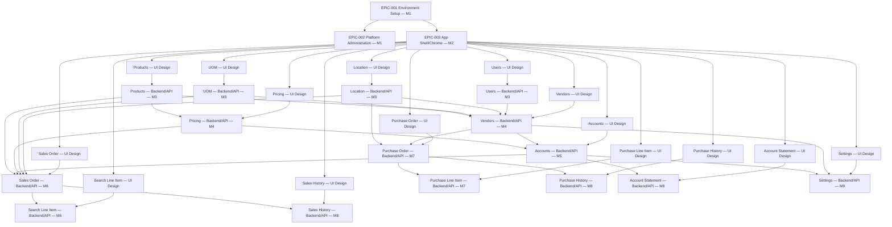

# Dependency Graph

## Epic-level (cross-milestone)

Read: an arrow `A --> B` means B depends on A. Rationale for the Backend/API ordering (M3-M9):

- **M3 (Users, Location, Products, UOM)** — no cross-module Backend/API dependency between them at
  this level (all foundational); scheduled together as the first backend milestone because
  everything downstream reads from at least one of them. [Source: `claude-docs/analysis/module-
  list.md` — Users "~126 other modules depend on it for permission checks"; Location "every
  transactional module joins against"; Products "widest blast radius of any single module."]
- **M4 (Vendors, Pricing)** — Vendors' purchasing taxonomy is consumed by Products (already built)
  and PurchaseOrder (later); Pricing's core engine depends on Products catalog data.
  [Source: `module-list.md` Vendors entry; `1-project/3-feature-breakdown.md` §7 module mapping.]
- **M5 (Accounts)** — depends on Vendors (SPA/MPL pricing exceptions reference vendor-adjacent
  pricing) and Pricing. [Source: `module-list.md` Accounts entry.]
- **M6 (Sales Order, Search Line Item)** — SalesOrder depends on Location, UOM, Pricing, Accounts,
  Products. [Source: `1-project/3-feature-breakdown.md` §6 FEAT-001 dependency row.] SearchLineItem
  is SalesOrder's sole read-model writer, so it follows directly.
- **M7 (Purchase Order, Purchase Line Item)** — PurchaseOrder depends on Vendors, Location.
  [Source: `1-project/3-feature-breakdown.md` §6 FEAT-004 dependency row.] PurchaseLineItem follows
  the same pattern as SearchLineItem.
- **M8 (Sales History, Purchase History, Account Statement)** — the two History accumulators are
  written as side effects of SalesOrder/PurchaseOrder finalize events. [Source:
  `1-project/3-feature-breakdown.md` §6 FEAT-013 dependency row.] AccountStatement depends on
  Accounts. [Source: same §6, FEAT-010 row.]
- **M9 (Settings)** — no other module structurally blocks on it per any located source; scheduled
  last despite being used broadly for configuration, since nothing else's *build* depends on it
  existing first.

## Task-level (within EPIC-001, EPIC-002, EPIC-003, EPIC-004, EPIC-005)

See `task-list.md`'s own **Dependencies** column for each task — not duplicated here as a second
graph; the table is the authoritative source, this document's Mermaid graph covers the epic level
only (where the fan-out is large enough that a table alone is hard to read at a glance). EPIC-004
(Users — UI Design)'s tasks (T-029–T-045) depend on EPIC-003's shell primitives (Sidebar/TopBar/
Sheet/Badge); EPIC-005 (Users — Backend/API)'s tasks (T-046–T-064) each wire onto their
corresponding EPIC-004 screen task, per the epic-level `UI_USERS --> BE_USERS` edge above.

EPIC-010 (UOM — UI Design)'s tasks (T-065–T-072) depend on EPIC-003's shell primitives
(DataTable/Dialog/Sheet); within the epic, Group List (T-068) and Group Detail/Edit (T-069) depend
on the Category/Type/Functional Role screens (T-065–T-067) for their dropdown data shapes, and
Conversion Factor History (T-070) / Import-Export (T-071) each depend on the Group screen they
attach to. EPIC-011 (UOM — Backend/API)'s tasks (T-073–T-082) each wire onto their corresponding
EPIC-010 screen task, per the epic-level `UI_UOM --> BE_UOM` edge above; within the epic, the Group
service (T-075) is the load-bearing task — Factor History (T-076), Picking Hierarchy (T-077), the
Conversion service (T-078), and Role-resolution (T-079) all depend on it, since BR-019's atomic
Group-save completeness check and BR-020's transaction-reference lock live there. No cross-module
Backend/API dependency exists between UOM and the other M3 modules (Users, Location, Products) — see
the Epic-level rationale above.

---

# Revision History

| Date | Change |
|------|--------|
| 2026-08-17 | Initial creation. |
| 2026-08-18 | Noted task-level dependency pattern for EPIC-004/005 (Users) now that real tasks exist. |
| 2026-08-18 | Noted task-level dependency pattern for EPIC-010/011 (UOM) now that real tasks exist (T-065–T-082); Group service (T-075) confirmed as the epic's load-bearing task. |
