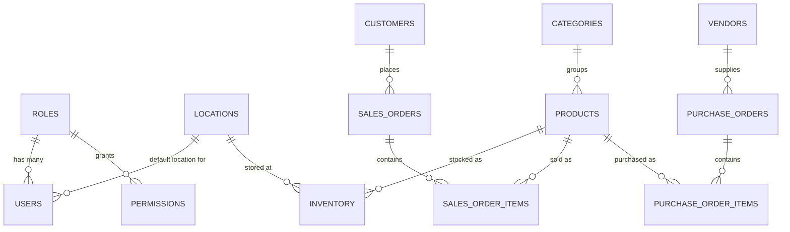
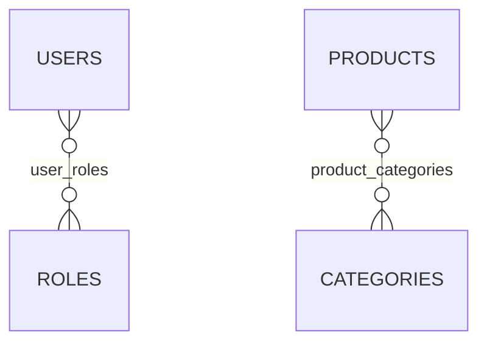

# Entity Relationship Diagram (ERD)

> **Purpose:**  
> This document provides a high-level view of the application's database structure. It identifies the entities (tables), their relationships, ownership, and cardinality. Detailed table definitions, columns, indexes, and constraints are documented in each module's `schema.md`.

---

# Document Information

| Property | Value |
|----------|-------|
| Project Name | <Project Name> |
| Document | Entity Relationship Diagram (ERD) |
| Version | 1.0 |
| Status | Draft / Review / Approved |
| Owner | <Owner Name> |
| Last Updated | YYYY-MM-DD |

---

# 1. Purpose

The ERD provides:

- Database overview
- Module relationships
- Foreign key relationships
- Cardinality
- Cross-module dependencies

It does **not** document:

- Column definitions
- Data types
- Indexes
- Validation rules
- Business logic

Those belong in:

```
modules/<module>/schema.md
```

---

# 2. Database Overview

Example Modules

```
Authentication
Users
Roles
Permissions

Masters
Products
Categories
Locations

Inventory

Customers

Vendors

Purchase

Sales

Reports
```

---

# 3. High-Level Relationship Diagram



Replace the entities and relationships above with your actual modules. Mermaid renders natively in GitHub, GitLab, and most doc tooling — keep it in this form rather than reverting to ASCII art.

---

# 4. Entity List

| Module | Primary Entity |
|----------|----------------|
| Users | users |
| Roles | roles |
| Permissions | permissions |
| Products | products |
| Categories | categories |
| Inventory | inventory |
| Customers | customers |
| Vendors | vendors |
| Purchase | purchase_orders |
| Sales | sales_orders |
| Locations | locations |

---

# 5. Relationships

Cardinality and foreign keys for every one-to-many relationship in the diagram above (the full cardinality/type summary lives in the Relationship Matrix, §7 — this table adds the FK column).

| Parent | Child | Foreign Key |
|---|---|---|
| Roles | Users | `users.role_id` |
| Locations | Users | `users.default_location_id` |
| Categories | Products | `products.category_id` |
| Products | Inventory | `inventory.product_id` |
| Locations | Inventory | `inventory.location_id` |
| Customers | Sales Orders | `sales_orders.customer_id` |
| Sales Orders | Sales Order Items | `sales_order_items.sales_order_id` |
| Products | Sales Order Items | `sales_order_items.product_id` |
| Vendors | Purchase Orders | `purchase_orders.vendor_id` |
| Purchase Orders | Purchase Order Items | `purchase_order_items.purchase_order_id` |
| Products | Purchase Order Items | `purchase_order_items.product_id` |

---

# 6. Many-to-Many Relationships

Examples



---

# 7. Relationship Matrix

| Parent | Child | Type |
|----------|--------|------|
| Roles | Users | 1:N |
| Locations | Users | 1:N |
| Categories | Products | 1:N |
| Products | Inventory | 1:N |
| Locations | Inventory | 1:N |
| Customers | Sales Orders | 1:N |
| Sales Orders | Sales Order Items | 1:N |
| Products | Sales Order Items | 1:N |
| Vendors | Purchase Orders | 1:N |
| Purchase Orders | Purchase Order Items | 1:N |
| Products | Purchase Order Items | 1:N |

---

# 8. Cross-Module Dependencies

| Module | Depends On |
|----------|------------|
| Products | Categories |
| Inventory | Products, Locations |
| Sales | Customers, Products |
| Purchase | Vendors, Products |
| Users | Roles, Locations |

---

# 9. Entity Ownership

| Entity | Module |
|----------|--------|
| users | Users |
| roles | Users |
| products | Products |
| categories | Products |
| inventory | Inventory |
| customers | Customers |
| vendors | Vendors |
| sales_orders | Sales |
| purchase_orders | Purchase |

---

# 10. Business Rules Reference

Business rules are documented in:

```
Business Rules.md
```

Examples

- Products must belong to a valid category.
- Sales Orders require an active customer.
- Inventory must reference an existing product and location.

---

# 11. Detailed Schema References

| Module | Schema Document |
|----------|-----------------|
| Users | modules/users/schema.md |
| Products | modules/products/schema.md |
| Inventory | modules/inventory/schema.md |
| Sales | modules/sales/schema.md |
| Purchase | modules/purchase/schema.md |

---

# 12. Related Documents

| Document | Purpose |
|----------|---------|
| Database Standards | Database conventions |
| System Architecture | Overall architecture |
| Module Schema | Table definitions |
| Business Rules | Business constraints |

---

# 13. Revision History

| Version | Date | Author | Description |
|----------|------|--------|-------------|
| 1.0 | YYYY-MM-DD | <Author> | Initial version |

---

# Notes

- This document provides a high-level view of the database.
- Detailed table definitions belong in each module's `schema.md`.
- Changes to entity relationships should be reflected here before implementation.
- Every foreign key relationship should be represented in this document.