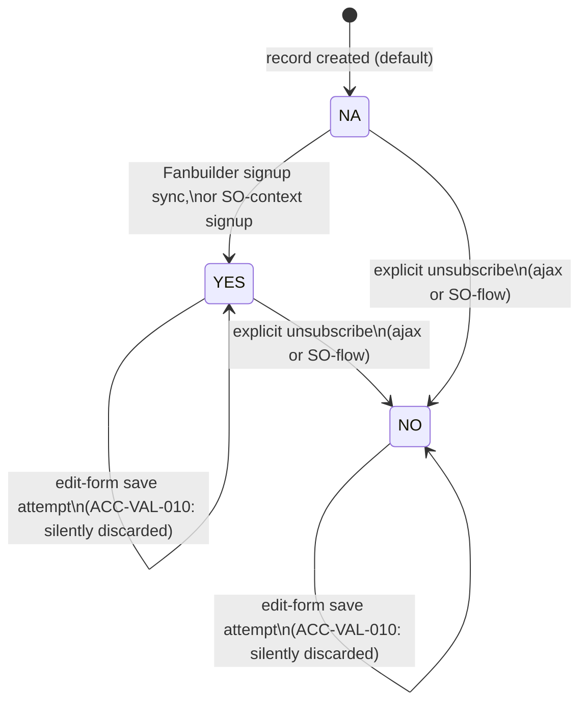

# Accounts — Workflows

## Applicability

Accounts does **not** have a formal status state machine, unlike SalesOrder's two-track (primary
lifecycle + tenant-configurable fulfillment pipeline) system. This is the headline finding of the
source status-lifecycle investigation (`docs_from_blueprint/module/Accounts/04-status-workflow.md`
§4.1), stated up front as the correct, investigated outcome — not an absence of investigation.

There is exactly one field on the Account record that is lifecycle-shaped — **Status**
(Active/Inactive) — and it was found to be **not enforced anywhere in the traced codebase**: no
save path, no Sales Order or Quote creation path, and no account-search path blocks or alters
behavior based on an account being Inactive. The remaining status-*shaped* fields (Status Code, Tax
Status, Fanbuilder Status, Deployment Status) are unrelated single-value configuration/health/
integration fields, not states in a workflow (§4.2).

Despite there being no real state machine, two fields do have transition-shaped behavior worth
documenting explicitly rather than omitting: Status's single (unguarded) default-on-create
transition, and Fanbuilder Status's genuinely guarded transitions (the only field on the Account
record with a real guarded write path and a real cross-module consumer). Both are captured below —
this file is deliberately short, mirroring the brevity of its source, because that is the correct
investigated outcome for this module.

## States

| State | Meaning |
|---|---|
| Status: Active | Default value; 982 of 983 live accounts are Active. Picklist-backed (`vtiger_status` table, two rows: Active/Inactive — genuinely enum-validated at the storage layer, unlike SalesOrder's own empty backing table for its primary status field). Confirmed **not to gate any behavior** anywhere in SalesOrder/Quotes save-and-finalize code, `InventoryUtils.php`, `CommonUtils.php`, or account search/typeahead. |
| Status: Inactive | 1 of 983 live accounts. Same "not enforced anywhere" finding applies. The two places `vtiger_account.status` is referenced outside Accounts' own field-write paths are non-gating: an opt-in CSV export filter, and a list-view filter clause that matches all three possible state values (Active/Inactive/blank) and is therefore a functional no-op. |
| Fanbuilder Status: NA | Default/initial value. 100% of live accounts (983 of 983) — no account has ever signed up for/synced with the Fanbuilder e-commerce integration in the traced data, so this field's transition behavior is entirely code-confirmed rather than DB-observed. |
| Fanbuilder Status: YES | Signed up/synced with Fanbuilder. 0 live rows but code-confirmed via two signup-sync endpoints. |
| Fanbuilder Status: NO | Explicitly unsubscribed. 0 live rows but code-confirmed via two explicit-unsubscribe endpoints. |
| Status Code (`cf_720`) — not a workflow state | Picklist-backed "health" code (New / Normal / Past Problems / Unhealthy / Upset / VIP / Promo). Confirmed purely informational/display (a customer status icon on the POS screen) — no read site branches business logic on it. Listed here only to document that it was checked and ruled out, not because it participates in a transition. |
| Tax Status (`cf_724`) — not a workflow state | The one status-shaped field besides Status with real, confirmed enforcement (`isProductTaxableChecking()` combines it with a product's Tax Status at SO-save time), but it is read fresh on every SO line calculation rather than being advanced through tracked transitions — explicitly not a state machine. |
| Deployment Status (`vtiger_accountdepstatus`) — confirmed dead | Live table has 0 rows; a repo-wide grep found zero code references anywhere except the table's own schema definition. Dead/orphaned infrastructure, not a field requiring migration. |

## Transitions

| From | To | Trigger | Guard Condition | Side Effects |
|---|---|---|---|---|
| (new record, no value submitted) | Status: Active | Quick-account-creation or activity-linked (`apptId`) create path | Request did not supply a `status` value | None beyond the default assignment. Source: `Save.php:104-107` (ACC-VAL-004). Confidence: confirmed. |
| Status: Active | Status: Inactive (or any value → any value) | Normal edit-form save with Status changed | None — generic field, no guard, no side effect on the transition itself | None. Source: the generic vtiger save path (no Accounts-specific code). Confidence: confirmed (as an absence of a guard). |
| Fanbuilder Status: NA | Fanbuilder Status: YES | Fanbuilder-side signup sync, or SO-context Fanbuilder signup | Signup event received from one of three write endpoints (two Fanbuilder-signup-sync endpoints; one SO-context signup/unsubscribe flow in `modules/SalesOrder/fanbuilderManager.php`) | External Fanbuilder customer id captured into `cf_ma_fb_id`; change logged via `manageMAFBStatuslogs()`. Confidence: confirmed. |
| Fanbuilder Status: YES (or NA) | Fanbuilder Status: NO | Explicit unsubscribe action (dedicated ajax endpoint or SO-context flow) | User/system fires `updateFBstatus` or the equivalent SO-flow action | Logged via `manageMAFBStatuslogs()`. Confidence: confirmed. |
| Fanbuilder Status: (any non-empty) | (no change — blocked) | Normal account edit-form save with the field included in submission | ACC-VAL-010: existing DB value is non-empty | Submitted value silently discarded and overwritten back to the existing DB value; field also hidden from the edit form UI entirely (`EditView.php:97,116`). A user cannot change this field through the standard Accounts edit screen at all — only through the three dedicated ajax/integration endpoints above. Confidence: confirmed. |

No other Accounts field has a transition to document, because no other field was found to have a
guarded write path distinct from a plain, ungated field edit.

## State Diagram

Fanbuilder Status is the only field with a genuinely guarded transition set on the Account record —
shown below. Status (Active/Inactive) is intentionally omitted from the diagram since its only
"transition" is an unguarded default-fill on create, with no guard anywhere else; presenting it as a
diagram would overstate how state-machine-like it actually is.

## Open items carried forward

- Whether Status being genuinely picklist-backed (unlike SalesOrder's empty backing table) is
  deliberate or accidental is unknown — flagged for a product-owner question, not resolved here.
- The single live Inactive account was not individually inspected for any observable behavioral
  difference; the enforcement sweep is static code analysis, not a live behavioral test.
- Fanbuilder Status's three write paths were not cross-checked against each other for race
  conditions or inconsistent `cf_ma_fb_id` handling (in particular, whether the SO-context
  unsubscribe path clears `cf_ma_fb_id` the way a commented-out block elsewhere suggests was once
  intended).
- No Lockout or Past Due Lockout field appears anywhere in the source status-lifecycle
  investigation — this spec cannot claim any finding about such a field one way or the other,
  because that pass did not address it.
