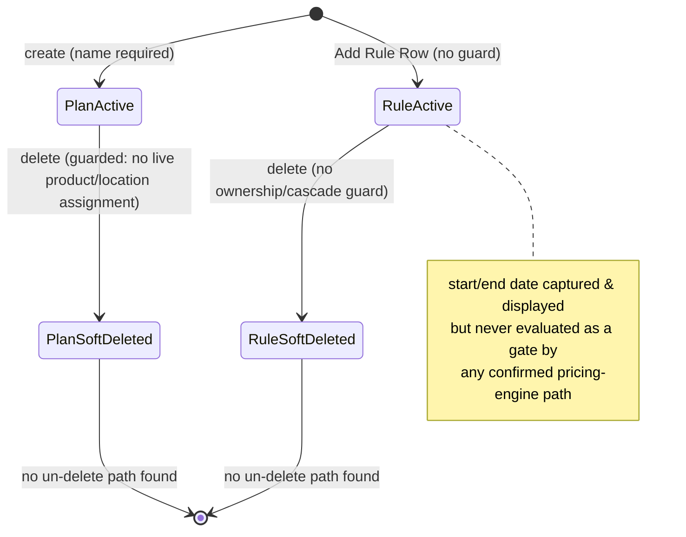

# MPLPricePlan — Workflows

> Keep this file even if this module has no lifecycle/state behavior — state that explicitly below
> rather than deleting the file. See `_deviations-from-original-template.md` in this folder.

Source: `docs_from_blueprint/module/MPLPricePlan/04-status-workflow.md`.

## Applicability

This module's own lifecycle is thin, but not absent: a plan and a rule row each carry only a binary
"deleted" flag; one of the two (the plan) is genuinely guarded against use-while-referenced, the other
(the rule) is not. The module's one real "toggle"-shaped state is not on the plan/rule entities at all —
it is a location-scoped support-field switch governing whether a plan's pricing grid is per-location or
copied uniformly to every location (see below). No date-range-gated "active" state is enforced anywhere
for the Rule sub-entity's own start/end date columns, despite their name — a genuine finding, not an
assumption.

## States

| State | Meaning |
|---|---|
| Plan — Active | The plan is present and usable; the default state for every plan row. |
| Plan — Soft-deleted | The plan is permanently excluded from use; no confirmed un-delete path exists anywhere in the source repository. |
| Rule row — Active | The rule row is present; carries a date range and scope-selection detail, but see the Workflows note below — its date range is never evaluated as a gate anywhere in the live pricing path. |
| Rule row — Soft-deleted | The rule row is excluded; its own scope-junction rows (linecode/subline/division/product) are **not** cleaned up by this transition — they remain orphaned until the plan-save flow's own delete-then-re-insert cycle happens to touch that specific rule again. |
| Location-uniformity toggle — Off (default) | A tenant-wide switch (not a per-record state): editing one location's pricing grid triggers a "copy to other locations" fan-out with no explicit location subset — every other tenant location's grid row for this plan is deleted and re-inserted with the same grid data just saved. |
| Location-uniformity toggle — On (opt-in) | The fan-out runs only for locations the user explicitly checked; otherwise only the current location's own row is touched, allowing genuinely per-location grids to diverge. |

## Transitions

### MPL Price Plan header — one real, guarded transition

**Live distribution**: 7 of 7 rows active (100%); 0 live rows soft-deleted.

| From | To | Trigger | Guard Condition | Side Effects |
|---|---|---|---|---|
| *(row created)* | Active | Plan created through the standard create/save flow | Name presence (whatever the generic entity-save framework enforces — see MPL-RULE-005 in `business-rules-and-validation.md`) | Triggers the plan's initial per-location grid row |
| Active | Soft-deleted | The plan-delete action | **Guarded**: the plan may only be soft-deleted if no live product/location assignment currently references it (MPL-RULE-023). The underlying query is SQL-injectable (MPL-RULE-022), but the guard logic itself is real. | On success: the plan is marked deleted. On failure: an error is returned identifying the plan by name ("this MPL Plan is not deleted due to its used/mapped in product record"). |
| Soft-deleted | Active | *(no code path found anywhere in this module or the wider source repository)* | N/A | N/A |

**This is the module's one genuinely disciplined lifecycle transition** — a real precondition, checked
before the state change, with a caller-visible failure message. **Confirmed absence**: a soft-deleted
plan cannot be un-deleted through any path found in the source blueprint.

### MPL Price Plan Rule — no equivalent guard

**Live distribution**: 1 of 1 rows active (100%) — the module's single live rule row; 0 live rows
soft-deleted.

| From | To | Trigger | Guard Condition | Side Effects |
|---|---|---|---|---|
| *(row created)* | Active | The "Add Rule Row" action | None — inserts a blank row keyed only to the current plan id (MPL-RULE-024) | None |
| Active | Soft-deleted | The rule-row delete action (single or bulk) | **None** — the delete runs unconditionally on whatever id(s) are submitted, with no check that the rule belongs to the plan currently being edited, no check that it is not already deleted, and (MPL-RULE-026) the query itself is SQL-injectable | None beyond the flag flip — the rule's own scope-junction rows are not cleaned up by this action; they remain orphaned against a now-deleted rule id |
| Soft-deleted | Active | *(no code path found)* | N/A | N/A |

**Contrast**: the plan-level delete has a real, working data-integrity guard; the rule-level delete has
none — any rule id can be deleted regardless of state, and doing so leaves its scope-junction rows behind
rather than cascading the delete.

### The location-uniformity toggle — a tenant-wide switch, not a per-record state

| Toggle state | Behavior on grid save |
|---|---|
| **Off (the default)** | The "copy to other locations" fan-out runs with no explicit location subset — every other tenant location's grid row for this plan is deleted and re-inserted with the same grid data just saved for the "current" location (MPL-RULE-029). In effect: with this switch off, a plan's pricing grid is uniform across all locations, and editing it for any one location silently overwrites every other location's grid for that plan. |
| **On (opt-in)** | The fan-out runs only if the user has explicitly checked one or more "copy to" locations in the UI — otherwise only the current location's own row is touched, allowing genuinely per-location grids to diverge. |

**Business meaning**: because the default is "off" (uniform-copy), the "genuinely different pricing per
location for the same plan" capability the module's own per-location grid table is built to support is
**opt-in, not the default behavior** — a tenant must explicitly enable the toggle for location-specific
grids to persist independently. Whether this default is intentional/well-understood operational behavior,
or a latent data-integrity footgun, is not resolvable from code alone.

### Rule sub-entity start/end date — named like a lifecycle gate, not enforced as one anywhere found

**Confirmed: the Rule sub-entity's start/end date columns do not function as an effective-date gate
anywhere in the live pricing-computation path.** The confirmed live pricing-computation entry point never
reads the Rule sub-entity's own table at all, so it never filters by that table's start/end date
columns — and no other code path in the searched source repository reads these two columns for any
gating purpose either. The Rule sub-entity's date range is captured, displayed (with a date-picker widget
and a "Reset Date" control), and persisted — but never evaluated against "today" or a sale's transaction
date by any code the source blueprint found.

### No plan-level active/inactive business-status field exists — confirmed absent

The plan header carries no status/active/enabled-shaped column beyond the deleted flag itself. A plan is
either present (usable) or soft-deleted (permanently excluded) — there is no intermediate
draft/published/suspended state. Whether a plan is currently in use is not a stored attribute of the plan
itself at all — it is only ever computed on demand, at delete time, by the delete guard's own count check;
there is no "is this plan in use" indicator surfaced anywhere in the plan's own edit or list views.

## State Diagram

## Required resolution for a new implementation

Given the thinness of the legacy lifecycle, a new implementation's own status/lifecycle design should
carry forward the following as explicit decisions rather than silent defaults:

1. **Preserve the plan-delete usage guard exactly** — the module's one working integrity check should be
   reproduced as a domain invariant on the plan entity's own delete operation, correctly parameterized
   rather than merely correctly reasoned (see MPL-RULE-022/023).
2. **Give the rule-delete operation the ownership/cascade guard it currently lacks** — verify a rule
   belongs to the plan the delete request nominally targets, and cascade the delete to all four
   scope-junction tables in the same operation, closing the orphaned-scope-row gap.
3. **Preserve the location-uniformity toggle as an explicit, named capability with both modes kept** —
   this is a genuine, apparently-intentional business capability, not merely a bug — but the "silent
   overwrite" half of the footgun should be closed with an explicit confirmation step naming
   which/how-many locations will be overwritten before the uniform-copy action proceeds.
4. **The Rule sub-entity's date-range fields should not be assumed dead** — they are unconsumed, not
   proven meaningless; a new implementation should not silently drop or silently activate this gating
   behavior without the same explicit, human-owned decision this document defers throughout for the Rule
   sub-entity's fate (see `risks-and-open-questions.md`).

## Open Items

- Whether the Rule sub-entity's start/end date and scope columns were ever consumed by a pricing-engine
  code path that has since been removed, or were never wired up in the first place — not resolvable from
  static code alone; the module's own change history was not examined in the source blueprint.
- Whether the location-uniformity toggle's default-off (uniform-copy) behavior is the intended default,
  or a footgun — not resolvable from code alone.
- Whether the rule-delete operation's missing ownership check has ever allowed a rule belonging to one
  plan to be deleted while editing a different plan's Rule Section — the client-side request is scoped to
  whatever rows are currently rendered in the requesting plan's own grid, so this is likely difficult to
  exploit through the normal UI, but the server-side endpoint itself enforces no such scoping.
