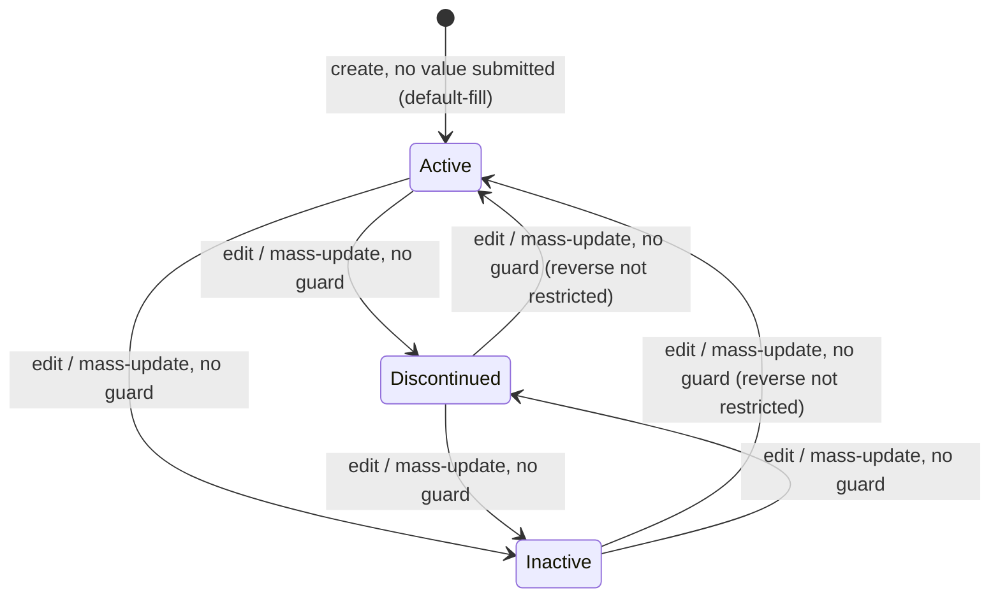
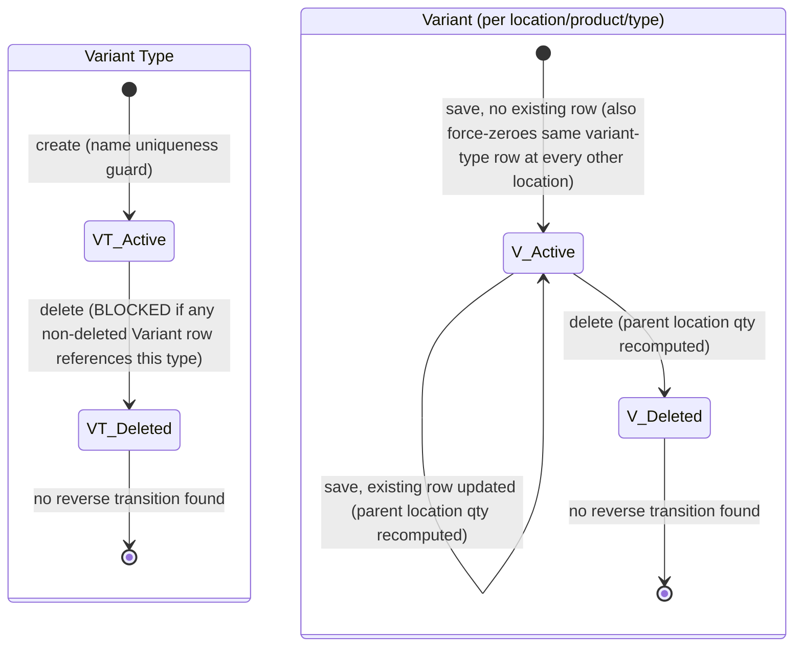
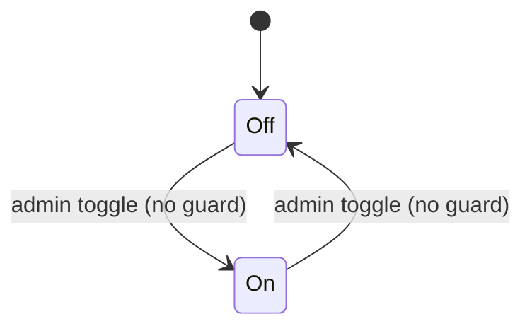

# Products — Workflows

> Keep this file even if this module has no lifecycle/state behavior — state that explicitly below
> rather than deleting the file. See `_deviations-from-original-template.md` in this folder.

**Source**: `docs_from_blueprint/module/Products/04-status-workflow.md` (Doc1 §03), extended by
`blueprint/module/Products/09-implementation-plan.md` §4 (Doc2 §4).

## Applicability

Unlike some other blueprinted modules where status turned out to be a single overloaded field or a
mostly-inert flag, Products genuinely contains **several independent status-shaped concerns of
materially different character** — a catalog-master module's status surface is inherently more varied
than a transactional module's. The source blueprint investigated six areas. Three are real,
enforced-or-guarded lifecycle behavior and get full States/Transitions/State Diagram treatment below:

- **Part Status** (§Part Status) — the single most pervasively-enforced status field found anywhere in
  this blueprint series (60+ consuming files), though it has no *guarded* transitions.
- **Variant Lifecycle** (§Variant Lifecycle) — a real, reasonably well-guarded lifecycle across two
  related entities (Variant Type, Variant), but confirmed 100% dormant on live data.
- **AUPF Rule "Auto Update" toggle** (§AUPF Rule "Auto Update" Toggle) — a plain, ungated two-state
  toggle on the *rule*, not the product.

Three more areas were investigated and are documented here precisely because the source blueprint
confirms they are **not** meaningful lifecycle concepts, rather than being silently omitted:

- **Product Active** (§Product Active (Legacy, Inert)) — a legacy sibling field, structurally superseded
  and confirmed inert.
- **Supersession (Product header)** (§Supersession (Product Header) — Confirmed Absent) — the Product
  entity itself has no confirmed, currently-functioning lifecycle transition tied to supersession; the
  live write path is entirely on Location's own table.
- **MPL Schedule status and Barcode ambiguity** (§Confirmed NOT Lifecycle Concepts) — the source blueprint
  is explicit that neither has any status/lifecycle field at all, of any kind.

This module is therefore **applicable** for a workflows document, but as a set of parallel, independently
documented status concerns rather than one single state machine.

## Part Status

**Enumeration**: Active / Discontinued / Inactive. Backed by a plain three-value field with **no backing
lookup/picklist table** in the live system (Doc1 §03 §1.1) — the three values are effectively hardcoded
at the presentation layer, not validated against a database-side picklist.

### States

| State | Meaning |
|---|---|
| Active | Default state on create. Fully visible to and selectable from every consuming context (sales-order/PO/receiving line entry, BOM/manufacturing part selection, stock-transfer picker, e-commerce catalog push, ~30 report files, sales-rank computation, cross-reference number search). |
| Discontinued | Excluded from ordinary product-selection contexts (order entry, receiving, BOM, stock-transfer, reporting, sales-rank, cross-reference search). Still visible in the catalog-management listview so an administrator can find and re-activate it. |
| Inactive | Same exclusion behavior as Discontinued in every confirmed consuming context; the source blueprint did not find a behavioral distinction between Inactive and Discontinued beyond the label itself. |

### Transitions

| From | To | Trigger | Guard Condition | Side Effects | Confidence |
|---|---|---|---|---|---|
| *(new record, no value submitted)* | Active | Product create | Field empty at save time | None beyond the default-fill (matches PROD-RULE-012) | Confirmed |
| Active | Inactive / Discontinued (or any other value) | Edit or mass-update, Part Status changed | None — plain field save, no guard | Exclusion from the shared filter/read-model consumed by 60+ downstream contexts | Confirmed |

**No other Products-specific write site was found** — no auto-deactivation cron, no supersession-driven
status flip, no expiration-driven transition tied to the Sales Start/End Date fields (Doc1 §03 §1.2). The
source found no evidence of a *guarded* transition anywhere in this field: nothing prevents Active →
Discontinued directly, no required intermediate state, and no confirmed reverse-transition restriction
either — only heavy *consumption* of whatever value is currently stored, not gated *movement* between
values.

**Direct answer to the practical question the source blueprint set out to resolve**: yes — an Inactive or
Discontinued product is confirmed blocked from being added to a new order line item and from a new
receiving line item, via the ordinary product-search mechanism (the only practical way a user locates a
product to add a line).

**What the new design should do differently** (Doc2 §4): no richer state machine is invented — the
substantive design change is making the **enforcement** consistent, i.e. every one of the 60+ consumer
categories should query against one shared read-model/filter concept rather than each of dozens of files
independently re-deriving the identical exclusion condition, closing a maintenance-burden risk of drift
even though the source found no evidence any currently exists.

### State Diagram

Any transition among the three values is a plain, unguarded field save — the diagram shows all
directions as open because the source blueprint found no restriction on any of them, not because any
specific direction was independently exercised and confirmed.

## Product Active (Legacy, Inert)

A structurally identical-looking boolean sibling field exists on the Product header and is **completely
inert**: 100% of live products show it unset, with only two peripheral read sites found (neither a
save-time nor an order-entry gate), and no Products-specific write site beyond the standard generic
pass-through save (Doc1 §03 §1.4). This reads as the module's status concept having been re-platformed
once already, with the old field left in place unused rather than removed — Part Status was introduced as
a custom field substantially later than this legacy field.

No States/Transitions/State Diagram content is provided for this field: there is nothing to diagram. The
field has no confirmed write site that sets it meaningfully and no confirmed consuming logic that gates
on it.

**What the new design does**: does not carry this field forward — Part Status is the sole status concept;
carrying forward a second, structurally-superseded boolean would just reintroduce the exact duplication
the source blueprint found, with nothing gained.

## Supersession (Product Header) — Confirmed Absent

This is a real, worth-stating-plainly **negative finding** (Doc1 §03 §2), not an oversight: the
Products-side supersession trigger's entire write statement targets only Location's own table — "the
Product entity itself has no confirmed, currently-functioning lifecycle transition tied to supersession."

A separate, distinctly-labeled, live-populated pair of fields *does* exist on the Product header itself
("Part Superseded" / "Superseding Product Number") — six live rows carry real data. But an exhaustive
negative search (the supersession trigger script itself, both mass-update mechanisms, CSV import) found
**no write site anywhere in the traced codebase** for this Product-header pair. The six live values most
plausibly originate from a one-time data migration or a since-removed code path — this remains unresolved
(Doc1 §03 §2.2, tracked as risk-register item R20; also see Open Questions below).

No States/Transitions/State Diagram content is provided for this concern: there is no confirmed write
path to diagram a transition against.

**What the new design does**: the Product-header pair is kept as typed fields (real data exists) but is
explicitly documented as a **read-only projection** of Location's own authoritative supersession
transition — never an independent Products-owned write path (Doc2 §4). This closes the exact gap the
source found (a header field that looks live-maintained but isn't) by making the Product-header copy a
deliberate, one-way-synced denormalization rather than a second, silently-orphaned source of truth. See
this module's cross-module integrations documentation for the cross-module handoff this implies, and see
Location's own module spec for the actual supersession lifecycle/state machine, which lives there, not
here.

## Variant Lifecycle

Unlike Product Active and Supersession above, this is a genuine, reasonably well-guarded lifecycle across
two related entities (Doc1 §03 §3) — but confirmed **100% dormant on live data**: both the Variant and
Variant Type tables show zero live rows on the system this blueprint was extracted from, and the
Product-header "Is Variant Product" flag shows zero live "Yes" rows either.

### Variant Type

**States**

| State | Meaning |
|---|---|
| Active (non-deleted) | Normal usable state. Create/rename gated by a case-sensitive exact-duplicate-name check against other non-deleted types (a real uniqueness guard). |
| Deleted (soft-deleted) | Terminal — no reverse (deleted → active) transition was found anywhere. |

**Transitions**

| From | To | Trigger | Guard Condition | Side Effects | Confidence |
|---|---|---|---|---|---|
| *(new)* | Active | Create action | No existing non-deleted type with the same name | None | Confirmed |
| Active | Deleted | Delete action | **Hard block** if any non-deleted Variant row still references this type — the one hard block found in this family | None beyond the flag | Confirmed |
| Deleted | *(no reverse transition — none found)* | N/A | N/A | N/A | Absence confirmed |

### Variant (the per-product-per-location quantity-on-hand row)

A real create → update → soft-delete cycle, merged into one upsert call: create/update are the same
operation, distinguished only by whether a row already exists for the (location, product, variant-type)
triple. A cross-location side effect exists: editing a variant at one location unconditionally
force-zeroes the same variant-type's row at **every other** location in the same call. Both the save and
delete paths end by recomputing the parent location's own displayed quantity-on-hand as the live sum of
the product's non-deleted variant rows — meaning a product with variants has its displayed location-level
quantity **entirely derived** from its variant rows, not independently editable once variants exist.

**States**

| State | Meaning |
|---|---|
| *(no row)* | No variant row exists yet for this (location, product, variant type) triple. |
| Active (quantity set) | Row exists with a quantity; contributes to the parent location's recomputed quantity-on-hand sum. |
| Deleted (soft-deleted) | Excluded from the parent location's quantity-on-hand recomputation; no reverse transition found. |

**Transitions**

| From | To | Trigger | Guard Condition | Side Effects | Confidence |
|---|---|---|---|---|---|
| *(no row for this product/location/type)* | Active (quantity set) | Save action, no existing row for the (location, product, variant type) triple | No existing row found for the triple | Every *other* location's same-variant-type row is simultaneously force-zeroed; parent location's displayed quantity-on-hand recomputed as the live sum of non-deleted variant rows | Confirmed |
| Active | Active (quantity updated) | Save action, existing row found, editing the variant's "home" location | Existing row found for the triple | Parent location quantity recomputed | Confirmed |
| Active | Deleted | Row-level delete flag set during a save submission, or a dedicated delete action | None beyond the flag | Delete executed; if via the dedicated delete action, parent location quantity is force-recomputed as zeroed rather than re-summed | Confirmed |
| Deleted | *(no reverse transition — none found)* | N/A | N/A | N/A | Absence confirmed |

### State Diagram

**What the new design does** (Doc2 §2.1 Decision D12, §11 Phase 7): per the source blueprint's own
implementation plan, this is **not** unilaterally dropped as an unused feature — the entity design is
carried forward in full (including formalizing the quantity-on-hand-derivation relationship as a real
domain invariant, closing the un-cross-checked ambiguity flagged in Open Questions below by construction
rather than convention), but its **build** is deliberately sequenced last among the module's core
entities, gated on explicit product-owner confirmation that it is a genuinely planned-but-currently-unused
feature worth building to spec, not dead weight safe to defer past the initial build.

## AUPF Rule "Auto Update" Toggle

A genuine enabled/disabled lifecycle state for the *rule itself* (not the product): a plain flag
distinguishing whether a saved rule is picked up by the unattended daily cron versus needing a human to
trigger it manually or via a specific one-time scheduled date (Doc1 §03 §4). A parallel Auto-Update
Subline rule family has the identical toggle mechanism.

### States

| State | Meaning |
|---|---|
| Off (disabled) | Rule is not picked up by the daily unattended cron; must be triggered manually or via a specific one-time scheduled date. Every live rule on the system this blueprint was extracted from is currently in this state. |
| On (enabled) | Rule is picked up by the daily unattended cron's automatic-application selection query. |

### Transitions

| From | To | Trigger | Guard Condition | Side Effects | Confidence |
|---|---|---|---|---|---|
| Off | On | Admin toggles the rule's settings screen | None — pure toggle, always flips to the opposite of the current value | None beyond the flag write; changes which rules the daily cron selection query includes | Confirmed |
| On | Off | Admin toggles the rule's settings screen | None — pure toggle | Same as above, in reverse | Confirmed |

### State Diagram

**What the new design does**: carries this forward exactly as documented — a boolean, not a state
machine. The only write site is a small settings screen that reads the current value and writes back its
exact opposite, with no cascading consequence beyond changing which rules a future cron run considers.

## Confirmed NOT Lifecycle Concepts

The source blueprint investigated two further areas and found, explicitly, that neither is a
lifecycle/status concept at all — recorded here as a stated negative finding rather than omitted
silently.

### MPL Schedule Status

The MPL Price Plan Rule entity has an effective start-date/end-date pair and a soft-delete flag, but **no
draft/scheduled/applied/expired status column of any kind anywhere in the schema** (Doc1 §03 §5). The live
price-lookup path (traced independently elsewhere in this module's spec) does not consult the date range
at all when resolving a product's current price — "a real, confirmed config input, not a state
machine... the config input wasn't even confirmed to be read anywhere outside its own management
screens." **The new design does not invent a status field to accompany it** — the substantive design
question (what the date range is actually *for*) is resolved separately elsewhere in this module's spec
(the date range is repurposed as an assignment-scheduling input, not a lookup-time gate); this section
exists only to confirm no separate lifecycle field is invented alongside that resolution.

No States/Transitions/State Diagram content applies — there is no status field to model.

### Barcode Ambiguity Resolution

The staging table behind barcode-ambiguity detection has no per-product row and no resolved/pending
status column of any kind — it is a bare per-barcode-value duplicate-count table. "Resolution" exists
purely as an in-browser-session, per-operator working set of flagged pairs, with no write-back to any
table confirmed anywhere in the source blueprint's read scope (Doc1 §03 §6). This is directly parallel to
how another blueprinted module's login-lockout state was found to be session-scoped only, never persisted
— "barcode ambiguity" is better modeled as a **computed view** (a live duplicate query against current
barcode values) than as a status a record can hold. **Under the new design's real barcode-uniqueness
constraint** (see this module's entities-and-fields documentation, requirement R3), this entire concern
is eliminated at the source — a duplicate cannot be saved in the first place, so there is no ambiguity
state, computed or otherwise, to model.

No States/Transitions/State Diagram content applies — there is no persistent state to model, and the new
design removes even the possibility of the underlying condition.

## Open Questions

- **Supersession (Product header)**: who or what sets the Product-header supersession pair's six live
  populated values is unresolved — the write-site search covered the supersession trigger script, both
  mass-update mechanisms, and CSV import, all negative. Until resolved, a new implementation should
  **not** assume these two fields are live-maintained (tracked as risk-register item R20).
- **Variant Lifecycle**: whether a product with variants can also have its ordinary (non-variant)
  quantity-on-hand edited directly through the standard save path, and if so what happens on the next
  variant save, was not cross-checked against the variant-handling functions in the source blueprint —
  low urgency given the subsystem is confirmed 100% dormant on live data, but flagged for resolution
  before the variant build phase begins.
- **Barcode Ambiguity Resolution**: the unlocated process that populates/clears the barcode-ambiguity
  staging table remains unlocated — without finding it, whether barcode-ambiguity detection ran on a
  schedule, on every save, or on-demand in the legacy system is unconfirmed (moot under the new design's
  real uniqueness constraint, but relevant to migration-time duplicate-audit planning).
- **MPL Schedule Status**: the exact relationship/precedence between the MPL Price Plan Rule's
  filter-join scoping and how a product ends up with a specific Price Plan assigned in the first place
  was not resolved — the source blueprint confirms only *which source is read* at lookup time, not
  *how/when the assignment itself happens*.
- **AUPF Rule "Auto Update" Toggle**: whether the per-product AUPF opt-out flag and Part Status interact
  (e.g. whether an Inactive/Discontinued product is implicitly excluded from AUPF rule application) was
  not directly tested — no practical live impact today since the opt-out flag is unset on 100% of live
  products, but could matter for the pricing-automation design.
