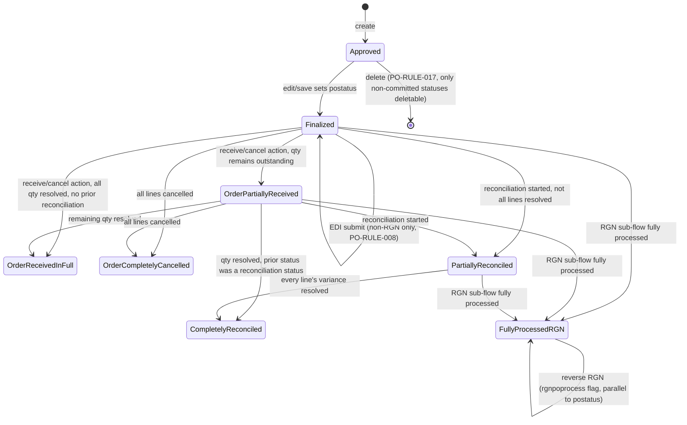

# PurchaseOrder — Workflows

Source: `docs_from_blueprint/module/PurchaseOrder/04-status-workflow.md`, itself traced to
`blueprint/module/PurchaseOrder/03-status-lifecycle.md`.

## Applicability

Applies in full. PurchaseOrder has substantial lifecycle/state behavior — a genuine multi-field
state machine, not a single overloaded status flag.

## A real, multi-field state machine

Unlike a single overloaded status field, PurchaseOrder tracks lifecycle across **three cooperating
fields** on the header entity, plus a full audit trail:

1. **`postatus`** — the primary status string; the main lifecycle driver.
2. **`po_rgn_status`** — an RGN sub-flow flag, layered on top of the primary status, not itself a
   full state machine (observed values: blank, `Submitted`).
3. **`reconciled`** — a 0/1 boolean guard used alongside `postatus` for delete/edit protection (see
   PO-RULE-017 in business-rules-and-validation.md).
4. **`vtiger_postatushistory`** — a full audit trail of status writes, via
   `PurchaseOrder::logToPoStatusHistory()`.

**The nominal picklist master table for `postatus`, `vtiger_postatus`, is confirmed empty (0 rows)**
in the live system. This means the "picklist" is, in practice, a free-text column enforced only by
scattered application-code string comparisons — a stray value written anywhere (a hand-run `UPDATE`,
an EDI callback) is not caught by any DB-level check. This is one of the module's confirmed
data-integrity findings, independently corroborated as Medium-severity risk PO-RISK-019 (see
risks-and-open-questions.md).

## States

| State | Meaning |
|---|---|
| Approved | Default post-create/edit state — the PO exists but has not been finalized. (846 live rows observed at blueprint time) |
| Finalized | Committed and ready for EDI submission — the only status from which manual EDI submission is permitted. (221 live rows) |
| Order Partially Received | Receiving has started; at least one line still has outstanding quantity. (28 live rows) |
| Order Received in Full | All lines fully received (and the PO was not previously in a reconciliation status). (250 live rows) |
| Order Completely Cancelled | Every line item has been cancelled. (3 live rows) |
| Partially Reconciled | Reconciliation has started; not every line's variance is resolved. (7 live rows) |
| Completely Reconciled | Every line's variance has been resolved through reconciliation. (70 live rows) |
| Fully Processed RGN | The RGN (Return Goods Notice) sub-flow has fully processed this PO's returns. (13 live rows) |

Live row counts are as observed at blueprint time and are illustrative of relative frequency, not a
current live count.

## Transitions

| From | To | Trigger | Guard Condition | Side Effects |
|---|---|---|---|---|
| (none) | Approved | PO creation | `Save.php:173` treats `postatus == 'Approved'` as the normal post-create/edit state | If the PO already has a number, a linked scheduled-PO-template row's `latest_action` is updated to `Modified` |
| Approved / any | Finalized | User action from the edit screen — client sets `postatus` in the submitted form. **No separate finalize-only endpoint exists**; `Save.php` is the single mutation point (unlike SalesOrder, which has two separate finalize entry points with a confirmed guard-drift defect between them) | — | `Save.php:154` treats `Finalized` and `Fully Processed RGN` as the two "committed" statuses that trigger Store-Transfer creation when a pending relationship row exists, and (from line 266) triggers the cost/receiving-price calculation block |
| Finalized | (EDI submitted) | Manual EDI submission | `manualSubmitEDI.php:26-29` — only a PO in `postatus == 'Finalized'` may be submitted through EDI; RGN-numbered POs (`cf_1103` prefixed `RGN`) are explicitly excluded regardless of status (PO-RULE-008) | — |
| Finalized / Order Partially Received | Completely Reconciled | Line-item cancel/receive action processed (`ProcessChanges.php`, lines ~120-165) and outstanding quantity reaches zero for all lines, and prior status was Partially Reconciled or Completely Reconciled | `quantity > qty_received + qty_cancelled` reaches zero for all lines | Written to both `vtiger_purchaseorder.postatus` (via `LEFT JOIN` update keyed by `cf_1103`, not the primary key) and logged to status history; mirrors into `fuse5_scheduled_po_templates.latest_action` when the PO originated from a scheduled template |
| Finalized / Order Partially Received | Order Received in Full | Same trigger as above, but prior status was not a reconciliation status | Outstanding quantity reaches zero for all lines | Same as above |
| Finalized / Order Partially Received | Order Partially Received | Same trigger as above | Outstanding quantity remains on at least one line | Same as above |
| Finalized / Order Partially Received | Order Completely Cancelled | Same trigger as above | Every line item is cancelled (`checkPOallCancelLineItem($PONumber)`) | Same as above |
| Order Partially Received, Finalized, Partially Reconciled | (reconciliation created/appended) | Reconciliation action (`POReconciliation.php`) | Eligibility query: `postatus IN ('Order Partially Received','Finalized','Partially Reconciled')` (general) or `postatus IN ('Fully Processed RGN','Partially Reconciled')` (RGN-side) | Creates/appends reconciliation header and line rows; ultimately pushes `postatus` to Completely Reconciled once every line's variance is resolved |
| (RGN cancel-item outcomes) | Completely Reconciled | RGN line item cancellation (`RGNCancelItem.php:125-149`) | All lines resolved with nothing outstanding and prior state indicating full completion | `po_rgn_status` set to `Submitted` whenever `postatus` becomes `Fully Processed RGN`, or when `sopotype == 'RGN'` is explicitly passed on save |
| (RGN cancel-item outcomes) | Order Completely Cancelled | RGN line item cancellation | Every item cancelled | Same as above |
| (RGN cancel-item outcomes) | Partially Reconciled (stays) | RGN line item cancellation | Some resolved, PO still Partially Reconciled | Same as above |
| (RGN cancel-item outcomes) | Fully Processed RGN | RGN line item cancellation | RGN fully processed | `po_rgn_status` set to `Submitted` |
| any (outside the six "committed" statuses) | (deleted) | Delete attempt | `Delete.php:14`, PO-RULE-017: deletion blocked when `reconciled='0' AND postatus IN ('Partially Reconciled','Completely Reconciled','Order Partially Received','Order Received in Full','Finalized','Fully Processed RGN')`; only POs still in Approved (or otherwise outside this list) can be deleted | This is the single clearest enumeration of which statuses the application treats as "committed" vs. "still mutable" |
| Fully Processed RGN | (reversed) | RGN reversal (`CreateReverseRGN.php`) | — | Sets a distinct `reverse_rgn_po` marker and `rgnpoprocess` enum (`RGNPOFINALIZED` / `RGNPOVIR` — "Void/Reversed") on the header. `rgnpoprocess` is **not** one of the 8 observed `postatus` values, confirming it is a parallel flag rather than a `postatus` value itself |

## The `update_prod_stock` side effect

`Save.php:115-126` — whenever a PO transitions **into** `Order Partially Received` (either on
create, or on edit where the previous status differed), `$focus->update_prod_stock` is set to
`'true'`, which drives automatic on-hand stock quantity updates for the received products.
Receiving is not merely a status-label change — it is an inventory-mutating transition, worth
calling out explicitly for a new implementation's event model.

## State Diagram

Note: `po_rgn_status` (blank/Submitted) and `reconciled` (0/1) are separate typed fields layered on
top of this diagram, not shown as their own states — see "A real, multi-field state machine" above.

## Required Resolution for a New Implementation

Per the module's governing architectural requirements (R2, R3 in entities-and-fields.md) and
`blueprint/module/PurchaseOrder/09-implementation-plan.md` Design Decision D-2, a new implementation
should:

1. **Model status as a real, populated, DB-or-code-enforced enum**, not a free-text column validated
   only by scattered `if ($postatus == 'X')` string-literal checks spread across at least five files
   (`ProcessChanges.php`, `RGNCancelItem.php`, `Save.php`, `Delete.php`, `manualSubmitEDI.php` today).
   The 8 observed live values above become the enum's initial member set.
2. **Own every transition and every status-dependent guard in a single status-service source of
   truth** — the delete-block list, the EDI-eligibility check, and the receiving-eligibility check
   should all read from the same authoritative transition table/enum, not be independently hardcoded
   per file the way they are today.
3. **Layer the RGN sub-flow (`po_rgn_status`) and the reconciliation guard (`reconciled`) as
   explicit, separately-typed concepts** on top of the primary status, preserving the legacy system's
   genuinely useful separation of "what stage is this PO in" from "has this PO's RGN batch been
   submitted" from "is this PO locked from deletion" — while making all three concepts owned by the
   same status service rather than three independently-checked fields.
4. **Write the status-history audit record only on actual transitions**, closing the confirmed data
   quality gap where the legacy history table logs every write regardless of whether `postatus`
   actually changed.

### Status-table redesign (real status-lookup-table proposal)

This is the same normalized status design proposed in entities-and-fields.md §5 problem 1, restated
here as the workflow-owning artifact:

- **`po_status`** — `id` (PK), `code` (unique, e.g. `APPROVED`, `FINALIZED`,
  `ORDER_PARTIALLY_RECEIVED` — the 8 observed live values as the seeded initial member set), `label`,
  `is_committed` (boolean — the single flag the delete-block list and receiving/EDI eligibility
  checks all read from instead of each re-deriving it), `sort_order`, audit columns. Populated at
  install time — an empty status table is no longer a possible state, closing risk PO-RISK-019.
- **`po_status_transition`** — `id` (PK), `from_status_id` (FK, nullable for the initial creation
  transition), `to_status_id` (FK), `trigger_code` (enum: `create`, `finalize`, `receive_partial`,
  `receive_full`, `cancel_all_lines`, `reconcile_partial`, `reconcile_complete`, `rgn_process`),
  unique on (`from_status_id`, `trigger_code`) so a given trigger from a given status has exactly one
  resolved outcome. Every status-dependent guard becomes a query against this table.
- **`po_rgn_status`** — `id` (PK), `code` (`NOT_SUBMITTED`/`SUBMITTED`), `label`.
- **`po_status_history`** — `id` (PK), `purchase_order_id` (FK), `from_status_id` (FK, nullable),
  `to_status_id` (FK), `changed_at`, `changed_by`, `invoice_number`, `invoice_amount`,
  `receipt_number`. Written only when a transition actually occurs.

## Open Items

- **`vtiger_postatus` being empty (0 rows) while 8 distinct values are live** — flagged as an open
  question whether this is an environment-specific gap in the development database
  (`lbm-local-integer`) or whether PurchaseOrder genuinely never seeds this picklist table
  module-wide (including production); cannot be resolved from a read-only dev-DB snapshot alone. See
  risks-and-open-questions.md PO-OQ-002.
- **`Smarty/templates/PurchaseOrder/getDeliveryLogForPO.tpl`'s controlling controller was not
  conclusively traced** — candidates are `getdiborderconfirminfo.php` or `getdcpostdata.php`, but no
  direct render call was found in the files read this pass; affects the delivery-log popup
  referenced in the status/receiving flow, not the core state machine itself. See
  risks-and-open-questions.md PO-OQ-003.
- The reconciliation query's two different `postatus IN (...)` eligibility lists (the general
  "pending reconciliation" query vs. the RGN-side query) were both transcribed above as documented,
  but their full interaction (e.g. whether a PO could ever match both) was not independently
  re-derived beyond what the source states.
