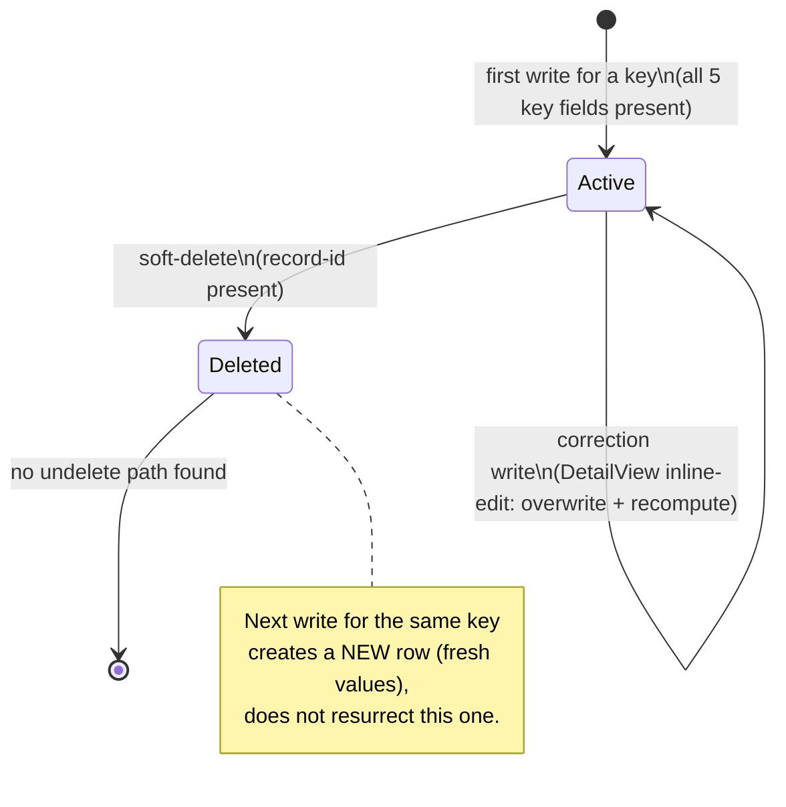

# SalesHistory — Workflows

> Keep this file even if this module has no lifecycle/state behavior — state that explicitly below
> rather than deleting the file. See `_deviations-from-original-template.md` in this folder.

Source: `docs_from_blueprint/module/SalesHistory/04-status-workflow.md`, tracing to
`blueprint/module/SalesHistory/03-status-lifecycle.md`.

## Applicability

**No domain-specific status/workflow concept exists for this module.** A direct schema check against
the module's full 24-column field catalog, filtered for status/flag/state-shaped column names, returns
zero matching columns. The only boolean/enum-shaped field on this entity at all is the generic
soft-delete flag every module in this codebase carries. SalesHistory is a pure rolling numeric
aggregate, not a workflow-bearing entity.

Because there is no status/workflow state machine, this file instead documents (a) the module's one
genuinely status-shaped field (soft-delete) and its transition, and (b) the module's real "lifecycle" —
a read-modify-write accumulator pattern, the closest analogue this module has to a state machine.

## States

| State | Meaning |
|---|---|
| Active | Row is a live, writable accumulator bucket — the default state on creation, and the only state a row is ever created in. |
| Deleted (soft) | The module's generic `Is Deleted` flag is set. Row is excluded from the CSV-export query's own filter and from every writer's own existing-row lookup going forward. |

## Transitions

| From | To | Trigger | Guard Condition | Side Effects |
|---|---|---|---|---|
| *(row created)* | Active | First write for a key from any writer | All five key fields present (SLH-RULE-002) | The "not found" branch sets the six accumulator fields directly from submitted values (not additive) and computes `total_activity` from them. |
| Active | Active | Every subsequent write for the same key, from the module's own save path or either confirmed cross-module writer | Existing row found for the five-field key | Reads existing row, **adds** the incoming delta on top of stored values, recomputes `total_activity` from the new running totals — a genuine read-modify-write accumulator, not create-once-then-edit. |
| Active | Active (corrected) | DetailView inline-edit correction | Record-id request parameter non-empty (SLH-RULE-014) | Directly **overwrites** whichever single field was edited (not a delta add), then recomputes `total_activity` from the row's now-partially-edited current values (SLH-RULE-015/016). A manual, user-triggered correction, distinct from every accumulate-a-delta write path — can silently desynchronize a row's stored quantity fields from what the accumulator paths would have produced. |
| Active | Deleted | User-initiated delete, routed through the shared soft-delete framework helper (SLH-RULE-012/013) | Record-id request parameter non-empty; no further guard inside the module's own delete file itself | Soft-delete flag set; row excluded from CSV export and every writer's existing-row lookup going forward. |
| Deleted | *(active)* | *(no reverse/undelete transition found anywhere in the module's own code)* | N/A | N/A — not independently re-verified against a repo-wide search in the source blueprint. |

**Note on the accumulator's interaction with soft-delete**: every writer explicitly filters on the
not-deleted condition in its existing-row lookup. Once a row is soft-deleted, the next write for that
same key will not find it and will instead create a **new** row with fresh (non-accumulated) starting
values, rather than resurrecting or accumulating onto the deleted row.

**No "close out the week" or "finalize the bucket" transition exists anywhere in this module's own
code, nor in either confirmed cross-module writer.** A row for a past week remains just as writable,
via the same accumulate-onto-existing-row logic, as a row for the current week, indefinitely. Whether
any confirmed writer ever actually writes to a past week's row is an open question the source blueprint
flags but does not resolve.

## State Diagram

## Required Framing for a New Implementation

A new implementation should **not** invent a status/workflow state machine for this entity where the
legacy system has none — per requirement R1 (`entities-and-fields.md`), the real design question is not
"what states does a Sales Activity record pass through" but "how does exactly one authoritative service
apply every writer's delta or correction to the current row, safely, regardless of which confirmed
writer produced it and in what order" — addressed in full in `calculations.md`. The soft-delete
transition and the accumulate-vs-correct distinction are the only two genuinely stateful behaviors this
module's blueprint confirms, and both should be preserved as explicit, named concepts rather than
folded together.

## Open Items

- Whether any confirmed writer ever accumulates onto a past week's row, or whether every writer is
  confined to the current week/year by its own selection logic — not resolved in the source blueprint.
- Whether the shared soft-delete framework helper's own internal logic performs any existence/reference
  check before soft-deleting a row — not independently re-read.
- Whether an undelete/restore mechanism for the soft-delete flag exists anywhere outside this module's
  own files — the source blueprint's check was scoped to the module's own directory only.

(Source: `docs_from_blueprint/module/SalesHistory/04-status-workflow.md`, full file.)
