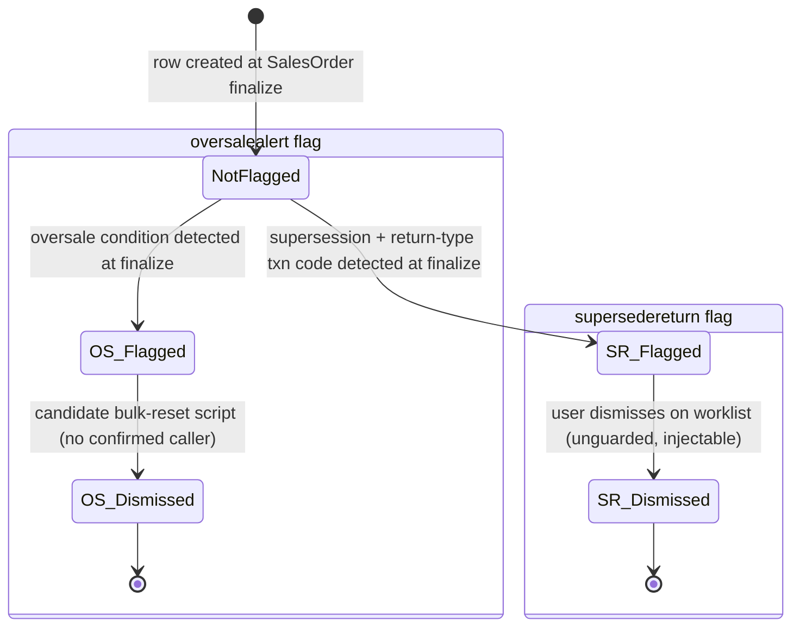

# SearchLineItem — Workflows

> Keep this file even if this module has no lifecycle/state behavior — state that explicitly below
> rather than deleting the file. See `_deviations-from-original-template.md` in this folder.

Source: `docs_from_blueprint/module/SearchLineItem/04-status-workflow.md`
(`blueprint/module/SearchLineItem/03-status-lifecycle.md`, Doc1 Pass 3, cross-checked against Pass 6/8).

## Applicability

Applicable, narrowly. Unlike SalesOrder, this module carries **no copy of its parent SalesOrder's own
status/sub-status** — confirmed two independent ways (a direct schema check for any status/flag/state-
shaped column, finding only two unrelated state-tax fields; and a re-grep of the field catalog,
confirming the only system-set classification-shaped fields besides the two alert flags are Transaction
Code — a fixed enum copied once at finalize and never itself transitioning through states — and the
generic soft-delete flag). **This module's only status-shaped fields are its two independent alert
flags** (`supersedereturn`, `oversalealert`), plus the generic `deleted` soft-delete flag (0 of 7,074
live rows set at blueprint time). Both flags are documented as their own mini-lifecycles below, not a
general order-status workflow.

## States

| State | Meaning |
|---|---|
| Not flagged | Default state for both `supersedereturn` and `oversalealert` — 7,074 of 7,074 rows (100%) for `supersedereturn` at blueprint time; 6,994 of 7,074 (98.9%) for `oversalealert`. |
| Flagged, pending action (supersedereturn) | Line's product is superseded and the line is a return-type transaction (transaction code `6`/`7`/`8`/`18`), still pending user action on the supersede/return worklist. 0 live rows on the blueprint's own snapshot — the flag is real and actively used historically/in production, just not currently set on this particular snapshot. |
| Flagged (oversalealert) | Line represents a sale that exceeded available stock at finalize time. 80 of 7,074 rows (1.1%) — a live, currently-flagged, currently-accumulating set. |
| Dismissed | Terminal state reached from Flagged; no reverse transition to Flagged found for either flag (a row's id is created once, so a dismissed alert cannot be re-armed short of a brand-new SO finalize on that same line, which cannot happen). |
| Not deleted / Deleted (soft-delete) | Generic soft-delete flag, independent of the two alert flags. 0 of 7,074 rows deleted at blueprint time — structurally present, unexercised on the blueprint's own dev snapshot. |

## Transitions

| From | To | Trigger | Guard Condition | Side Effects |
|---|---|---|---|---|
| *(row just created, no flag)* | supersedereturn: Flagged | SalesOrder finalize, for the SO line this row snapshots | Product has supersession data in Products/Location's own supersession-merge chain **and** the line's Transaction Code is one of the confirmed return-type codes | None beyond the flag write itself |
| supersedereturn: Flagged | supersedereturn: Dismissed | User clicks "Remove Alert" / "Action Taken, Remove Selected" on the module's own supersede/return worklist | Only that the submitted id-list is non-empty — **no check that the targeted row(s) actually carry the flag** (SLI-RULE-015); the write itself is a confirmed, unmitigated SQL injection (SLI-RULE-014) | None beyond the flag reset |
| supersedereturn: Dismissed | supersedereturn: Flagged | *(no reverse transition found)* | N/A — a dismissed alert is never re-armed by anything short of a brand-new SO finalize on that same line, which cannot happen (a row's id is created once) | N/A — confirmed absence, the only writer of the flagged state is the one-time finalize event above |
| *(row just created, no flag)* | oversalealert: Flagged | SalesOrder finalize, same routine that sets `supersedereturn` | An oversale condition detected at finalize time (the specific inventory-check logic upstream of this write was not traced) | None beyond the flag write itself |
| oversalealert: Flagged | oversalealert: Dismissed | *(corrected finding)* — a real, if narrow, dismiss script exists (resets by product+location+line-code combination, not by individual row id), driven by simple request parameters with no visible CSRF/permission check — but **no caller of this script was found anywhere in the repository** across two independent, repo-wide searches | Unconfirmed-reachable; see Open Questions | If reached: resets the flag for every row matching the product+location+line-code combination at once, not scoped to the individually flagged row |
| oversalealert: Dismissed | oversalealert: Flagged | *(no reverse transition found)* | N/A | N/A |

**Note on the missing state-guard**: because `supersedereturn`'s dismiss has no state precondition, the
"guarded transition" is only guarded on the *write* side (which lines get flagged in the first place);
the *dismiss* side has no state guard at all — any row, flagged or not, can be reset (or, given the
injection, arbitrary rows can be affected regardless of which id was submitted).

**`oversalealert` is the module's one genuinely surprising status finding, corrected across two later
blueprint passes.** An initial exhaustive search for any code path that clears this flag found none — a
finding that stood as "confirmed absence" through the module's status-focused pass. A later,
broader-scoped cross-module pass then found the dismiss script described above. The corrected finding is
therefore: "no *reachable* dismiss path found," not "no dismiss code exists at all." **Net effect,
either way**: `oversalealert` is a real, live, currently-accumulating flag (80 rows and growing) with no
*confirmed-reachable* way to dismiss it through the ordinary application. All three known consumers of
this flag (the oversale-list report, plus two Home-dashboard widget-count queries) are read-only
displays; none writes back to the row.

**Record lifecycle beyond the two flags.** Since this module's own save/delete scaffolding is vestigial
and the real write is SalesOrder's finalize routine, a repo-wide search for every update statement
against this table (beyond the two alert-flag writes) found exactly two genuine post-creation update
paths — the row is not immutable once written, but neither path is a general resync:
1. **Customer PO number propagation** — editing SO-level Customer PO Number on an already-finalized SO
   also updates every SearchLineItem row belonging to that SO with the new PO number.
2. **Line-number reconciliation** — a same-transaction repair pass, run once immediately within the
   same finalize routine, matches each just-created row against SalesOrder's own line-item table and, if
   matched, updates that row's line number.

No general refresh mechanism exists beyond these two narrow fields — if a finalized SO's line data
changes through some SO-side edit path not traced by this blueprint, the SearchLineItem snapshot would
go stale on every other field; this potential staleness was not tested against a live before/after SO
edit.

## State Diagram

## Required resolution for a new implementation

Per the module's governing architectural requirement R4 (both alert flags as first-class domain events
with typed, guarded dismiss commands):

1. **Both alert flags should be modeled as explicit, typed states** (e.g. not-flagged / flagged /
   dismissed), not raw booleans, each raised as its own domain event at the same finalize-time write
   that creates the row.
2. **Both flags need a permission-checked, state-precondition-guarded dismiss command.**
   `supersedereturn`'s legacy dismiss action exists but is both insecure (an unmitigated SQL injection)
   and unguarded (no check that the target row is actually flagged) — a new implementation must close
   both gaps in the same command. `oversalealert` needs a dismiss capability it never reliably had at
   all — a real, live, currently-growing operational-data gap (80 rows and counting), not a hypothetical
   one; the specific open question about the *scope* of that dismiss command (per-row vs. the legacy
   script's unsafe bulk product+location+line-code match) is carried forward as a risk item.
3. **No general "resync on SO-side edit" mechanism should be invented without evidence.** The blueprint
   found exactly two narrow, specific post-finalize update paths; a new implementation should implement
   those two as their own typed events rather than manufacturing a broader resync mechanism the legacy
   system never had.
4. **A status-history or audit trail for the two alert-flag transitions is not documented as existing in
   the legacy system.** Whether a new implementation should add one is a design choice not dictated by
   the blueprint either way.
